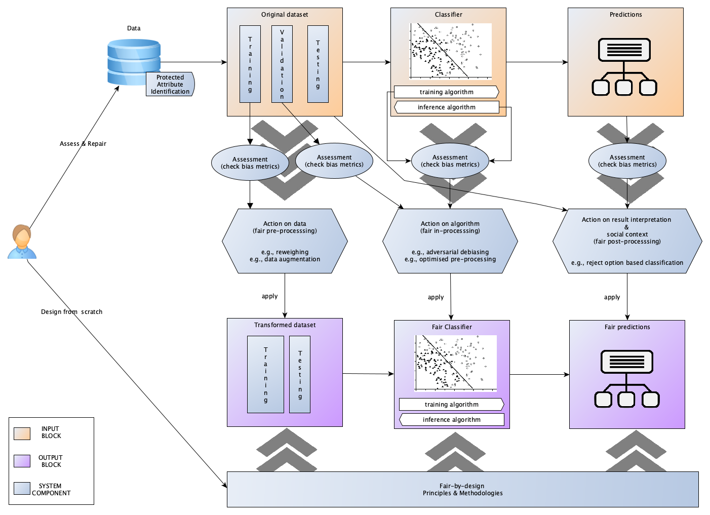
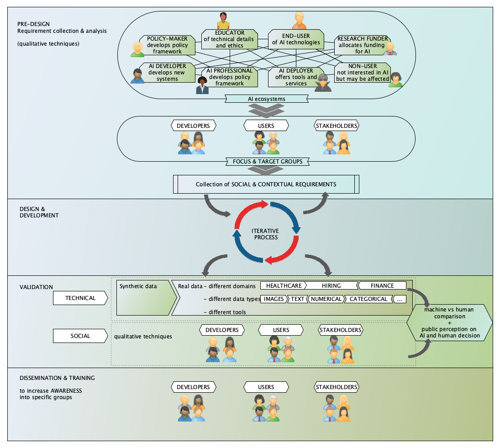

Purpose and Scope 
######################################################################

General Introduction
*********************

Artificial Intelligence (AI) systems are becoming increasingly pervasive in our daily lives, influencing decisions from hiring practices to loan approvals, as well as access to education and healthcare support. However, these systems are not immune to biases; in fact, they often reflect and can exacerbate societal inequalities. Once trained, a system that performs discriminatory actions can crystallize biases into automated, repeated behaviors on a large scale, thereby **amplifying** instances of **discrimination**.

**AI fairness** is a research field that addresses these issues by working to ensure that AI technologies are developed and deployed in an **equitable** way. The primary challenge in this domain is therefore to identify discriminatory behaviors, creating awareness among developers and users so that mitigation measures can be implemented.

The research field of AI fairness is very active today. Typically, there are two mainstream approaches:

* adopting a fair-by-design methodological approach during the design phase of an AI system, and
* measuring and mitigating discriminatory behaviors in existing systems.

 These two approaches are not mutually exclusive. Both approaches have a preliminary step, which is the **definition** of what **fairness** means in the context of the AI system's application.

::

    What does it mean to be non-discriminatory in a decision?

First, it is important to emphasize that the selected fairness definition will align with a certain **policy** that is to be enforced in a specific context. This definition will then be integrated into the algorithm.

When we move from a natural language definition of fairness that considers legal and social aspects to a concept that is understandable by an AI system, we refer to it as **computational fairness**.

.. note::

   **Computational fairness** refers to the practice of ensuring that algorithms and AI systems operate in a way that is equitable and free from bias. It involves **translating principles of fairness, which often encompass legal, ethical, and social dimensions, into precise, measurable criteria** that can be understood and enforced by computational systems.

In summary, computational fairness seeks to operationalize abstract fairness concepts into actionable, measurable practices within AI systems to ensure they are just and unbiased in their decision-making processes. This process typically includes:

* Defining fairness notions: establishing what fairness means within a specific context and translate it in computational terms
* Implementing fairness in algorithms: integrating fairness considerations into the design and functioning of AI systems
* Measuring and monitoring: continuously evaluating AI systems to ensure they meet fairness constraints. This includes using metrics to measure discrimination (see :ref:`AI Bias Detection`)
* Mitigation strategies: applying techniques to address and reduce identified biases (see :ref:`AI Bias Mitigation`)

The AEQUITAS project
*********************

Fairness stands as one of the main principles of Trustworthy AI promoted at EU level. How these principles, in particular fairness, translate into technical, functional social, and lawful requirements in the AI system design is still an open question. Similarly we don’t know how to test if a system is compliant with these principles and repair it in case it is not. AEQUITAS proposes the design of a controlled experimentation environment for developers and users to create controlled experiments for - assessing the bias in AI systems, e.g., identifying potential causes of bias in data, algorithms, and interpretation of results, - providing, when possible, effective methods and engineering guidelines to repair, remove, and mitigate bias, - provide fairness-by-design guidelines, methodologies, and software engineering techniques to design new bias-free systems The experimentation environment generates synthetic data sets with different features influencing fairness for a test in laboratories. Real use cases in health care, human resources and social disadvantaged group challenges further test the experimentation platform showcasing the effectiveness of the solution proposed. The experimentation playground will be integrated on the AI-on-demand platform to boost its uptake, but a stand-alone release will enable on-premise privacy-preserving test of AI-systems fairness. AEQUITAS relies on a strong consortium featuring AI experts, domain experts in the use case sectors as well as social scientists and associations defending rights of minorities and discriminated groups.

Objectives and Ambitions
------------------------
The **aim of AEQUITAS** to address and tackle the multiple manifestations of bias and unfairness in AI from all these dimensions.
Fairness is one of the four “Ethical Principles in the Context of AI Systems” as described in the Ethics Guidelines for Trustworthy Artificial Intelligence (EGTAI). It is closely linked to the three other principles (respect for human autonomy, prevention of harm and explicability) and involves numerous ways in which bias can have undesirable impact, such as discrimination, inequality, exclusion, segregation, marginalization, exploitation, and manipulation. One of EGTAI’s primary pillars is ‘lawfulness’ and fairness is indeed reflected in numerous fundamental rights, laws and governing principles, such as the European Pillar of Social Rights. The latter is the beacon for a fair and inclusive Europe and holds principles aimed at (a.o.) gender equality, equal opportunities, access to essential services.

The **second aim of AEQUITAS** is to foster the overarching principle and broad notion of AI fairness.
In order to ensure fair AI that reflects European values, many AI tools that belong to public and private actors need to be assessed, repaired and if necessary, replaced. However, the costs of replacing existing AI tools are high and unrealistic. In addition, new AI systems should be developed according to fair-by-design principles whose definition is now blurred and not clear for developers.

The **third aim of AEQUITAS** is to be mindful of the fact that, beyond its reflections in EGTAI and the law, the notion of fairness is also socially determined, and can differ between and even within cultures and social groups. What is legally ‘fair’ is not always fair from a specific societal viewpoint and vice versa. The AEQUITAS consortium includes associations representing socially vulnerable groups and special interest organizations to gather their input and specific expertise from various points of view regarding AI fairness.

AEQUITAS will raise social awareness, particularly among LGBTQI and women’s and other fragile groups at risk of AI bias and unfairness, as well as among socio-economically vulnerable groups at risk of digital inequality, such as children and the elderly. AEQUITAS will provide training content to reskill and upskill the labour force in companies and public bodies.
Experimentation tools and guidelines need to be accompanied with an increased technological and AI awareness among marginal and excluded communities, specifically on the impact of unfair and biased AI outcomes that can harm their options to have balanced and fair decisions in crucial domains (such as healthcare, access to labour and education). In addition, training guidelines to upskill personnel (engineers, managers, executives) both in private and public sectors are essential to guide innovation. In addition, the consortium will use the outcomes to generate awareness with groups from multiple EU regions, replicating the steps, lessons learned and outcomes using a regional plan, mimicking the steps, lessons learned and outcomes of EDIHs and Networks of Excellence's regional plans.
Europe's strategy aims to create an AI Ecosystem of Excellence and Trust where ethical and legal principles are pursued in all AI systems.
How to translate ethical principles, fairness in particular, into practical requirements is a fundamental need to make them a booster for high quality AI innovation in Europe.

::

    AEQUITAS proposes to create and broadly distribute an open playground for AI developers and users to create controlled experiments via the exploration of all experimental dimensions (factorial design) by turning the ‘dials’ that affect fairness. The open playground provides a technical and operational infrastructure to detect, mitigate and possibly repair potential issues of unfairness in AI tools (at data, model and interpretation level), as well as define new bias preserving methodologies. It will also guarantee that any new AI tool development can make use of and adhere to fair-by-design principles through software engineering guidelines.

How to perform controlled experimentation broadly accessible that reaches the wider community – academic and innovation – promoting European Values of an AI Ecosystem of Trust and Excellence.

Methodology
----------------
Figure below shows the high-level overview of the AEQUITAS stakeholder targets, the components and inputs, and how the consortium is built to cover all the needs to ensure that the outcomes guarantee inclusion and accessibility by the entire European AI Ecosystem and to reach a high impact.

.. image:: img/high-level-method.png
  :width: 600
  :alt: AEQUITAS in the EU Ecosystem Overview

In the upper part of the Figure a set of AI developers – e.g. AI Networks of excellence, AIDA, the European AI Alliance – are shown, that are creating new research results, AI assets and tools, and/or are involved in the public AI debate. These projects and initiatives are the key supporters of the creation of a European Ecosystem of Excellence and Trust. AEQUITAS is targeting them to ensure uptake of its deliverables and drive evaluation and reparation of already existing AI tools, in order to maximise the impact of the methodology, and fair-by-design guidelines and principles. In the regional dimension. SMEs and low-tech SMEs supported by DIHs are key players, as they will be using data and networks like the EUHubs4Data that build and unlock data spaces to be used for AI. AEQUITAS will target these players to assess bias in their dataset to be aware of it and possibly repair/mitigate, but also to support the generation of synthetic data if needed. On the right-hand side, enterprises, public bodies, associations, representative bodies and citizens provide input to AEQUITAS on the individual dimension with existing tools and datasets that are currently exploited by companies or available on the market – as use cases below in the figure. The combination of case studies from Adecco, Philips, IRCCS Bologna. Hospital, and University of la Laguna – and of the association partners of the Consortium– Women in AI, Arcigay, Period, Eurocadres and Asociacion Rayuela – will provide indicators that will be used to develop the AEQUITAS technology.

It is important to highlight the blue arrows as additional inputs to enrich AEQUITAS. Groups and associations involved in Human-01-24 financed projects will be engaged with the purpose of enriching the models but also to ensure the connections with other components of the AI ecosystem, supporting them to maximize their outcomes – ADR PPP, AI4Europe, BDVA, regional engagement or any of the networks of excellence where the consortium has current people as WP leaders or /and in executive boards. Finally, the outcomes are returned to the three stakeholders groups – green arrows – ensuring the interaction and support to AIDA – UCC is leading the education board in VISION and is in several management committees of AIDA – the Networks of Excellence and AI4EU – UMEA, LOBA, UNIBO, UCC are work package leaders and/or belong to governance boards – and the Digital Innovation Hubs – ITI is the coordinator of EUHubs4Data with more than 30 DIHs on different region.

AEQUITAS controlled testing and experimentation environment aims to (i) assess existing AI systems from the perspective of fairness, (ii) provide mitigation and reparation methodologies if possible, in case the AI system has biased outcomes, and (iii) design new AI systems by applying anticipatory fairness-by-design practices and methodologies. The experimental design platform allows the investigator (software engineers and developers supported by domain experts, legal experts and social scientists) to study the effect of each input factor on the fairness KPIs, as well as the effects of interactions between input factors on the fairness KPIs.
The AEQUITAS experimentation tool acts as an open playground, enabling the construction of controlled experiments according to a factorial design approach. We provide the users with control dials, corresponding to different bias related aspects, to study the effect of each input factor on the fairness KPIs, as well as the effects of interactions between input factors on the fairness KPIs.

The main architecture components and AEQUITAS’ logical blocks are depicted in the Figure below.

The orange blocks represent the possible inputs of the framework, the light-blue blocks the components of the system, while the violet ones represent the possible outputs. On the left is the interaction with the user who can select the "type" of use of the AEQUITAS framework: (1) as an assessment/reparation engine for an existing AI system or (2) as a supplier of guidelines, methods and techniques for a fair-by-design approach towards the design of a new AI system. Since the framework is an experimentation environment with different techniques made available to the user, the two types of usage can be intertwined–e.g., when the existing system cannot be repaired and needs to be redesigned from scratch.

* If the user selects the assess and repair functionality, it will be possible to provide the framework with one or more inputs: a) the dataset, b) the algorithm used, c) the output (predictions and decisions). An “assess and repair functionality” will allow users to carry out fairness assessments within these data, algorithm and interpretation dimensions. In the assessment phase, data, algorithm or interpretation will be evaluated against AI fairness metrics (KPIs). If fairness issues are detected, mitigation and reparation techniques can be applied and newly obtained KPIs compared with the initial ones. Users can simulate different effects on fairness KPIs by varying type and distribution of bias in data, correlation between characteristics, percentages of unknown attributes, etc.
* If the user selects to design a new AI application, the framework will provide fair-by-design guidelines, methods and techniques plus the testing and experimentation features described above.

It is worth highlighting that the AEQUITAS framework allows the assessment, diagnosis and reparation of data, algorithms, and interpretations of the outputs. The training set analysis helps in identifying bias in data, while the validation set contributes to identifying bias in the algorithm and in the interpretation of results. As regards the assessment and detection of bias at the algorithm level, both algorithms of an AI predictor will be considered (i.e., the training algorithm and the final inference algorithm). The system outputs will then be related to the inputs provided by the user after applying reparation/mitigation techniques to these inputs. It will then be possible to obtain (a) a modified dataset (b) a modified algorithm, or (c) a new indication on how to interpret the result.

The methodology is divided in four main phases:
#. Requirement collection & analysis. In this phase, the requirements for the AEQUITAS engines will be collected and analysed through a multidisciplinary process involving two dedicated focus groups: 1) expert group of sociologists, social scientists, computer scientists, AI developers, ethics and legal experts, to ensure that all relevant expertise is leveraged; A2) stakeholder group representing targeted, affected and underrepresented groups to ensure that their particular interests are reflected in the requirements. Moreover, targeted user groups will be created for each case study to reflect on the AEQUITAS framework from their specific points of interest. Our multidisciplinary approach requires that different disciplinary-specific tasks are coordinated. Sociology will serve AEQUITAS’ goals by using mainly qualitative techniques (focus groups and in-depth interviews). Each technique is dedicated to investigating a specific aspect of the behind-the-scenes of AI systems. Starting with the design phase, sociological techniques are used to set up a participatory design process through the involvement of marginalized social groups (by gender, race, health or disadvantaged socio-economic background). Participatory design is an approach aiming to design systems to build connections and promote work between developers, targeted groups and other stakeholders.

#. Framework development with legal and societal anticipation and awareness. Development of the controlled experimentation framework that includes the three sub-components (assessment & awareness, repair & mitigation, fairness-by-design methodologies) with clear identification of KPIs to measure fairness; this phase involves an initial subphase of requirements, data collections, plans for communication, dissemination, data management, and trustworthy (including lawful) AI evaluation on components design. AEQUITAS also develops new techniques for reducing or eliminating bias in AI systems grounding on the experience of its consortium.

#. Verification and Validation: Pilot. The verification and validation phase will be composed of the following stages: a) synthetic data generation b) validation of AI systems on synthetic data c) real data collection and d) validation of AI systems on real data. This facilitate a transition from TRL 3-4 to TRL 5. Use cases wselected to cover both distinct key domains (healthcare, hiring and sensitive social issues) and many distinct types of data.

#. Awareness, dissemination, communication and exploitation. This phase will underpin the sustainability of the project including the long-term uptake of AEQUITAS on the AI-on-demand platform and the adoption of the AEQUITAS methodologies by other sectors (both public and private).
