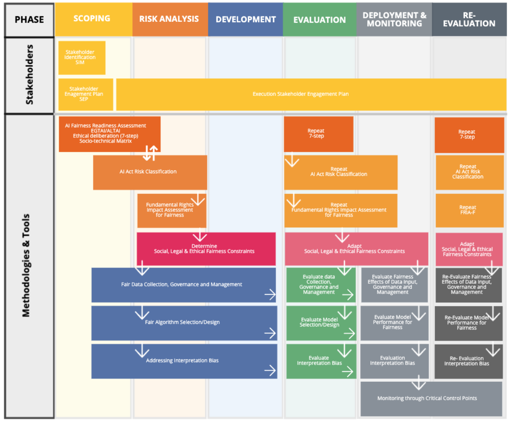

START EXPERIMENTING
########

Fair-by-Design Methodology
*************************************************

.. raw:: html

   

       
       <map name="fair_by_design_map" id="fair_by_design_map">
           <area shape="rect" coords="10,10,200,50" href="scoping.html" alt="Scoping Phase" title="Scoping Phase">
           <area shape="rect" coords="210,10,400,50" href="risk_analysis.html" alt="Risk Analysis Phase" title="Risk Analysis Phase">
           <area shape="rect" coords="410,10,600,50" href="development.html" alt="Development Phase" title="Development Phase">
           <area shape="rect" coords="610,10,800,50" href="evaluation.html" alt="Evaluation Phase" title="Evaluation Phase">
           <area shape="rect" coords="810,10,1000,50" href="deployment_monitoring.html" alt="Deployment & Monitoring" title="Deployment & Monitoring">
           <area shape="rect" coords="1010,10,1200,50" href="re_evaluation.html" alt="Re-Evaluation Phase" title="Re-Evaluation Phase">
       </map>
   

Experimentation Environment
*************************************************

.. raw:: html

   

       
   

