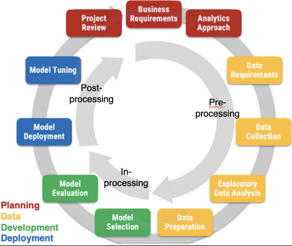

AI fairness in the AI system lifecycle: the holistic AEQUITAS approach
######################################################################

Introduction
************

**Fair-by-design methodology** refers to an approach in the field of AI where
fairness considerations are integrated into the AI lifecycle from the outset.
This methodology aims to ensure that AI systems are *fairly designed*,
addressing potential biases or discrimination (according to a particular
definition of fairness) during the design and development phase rather than
attempting to rectify them after deployment.

Fair-by-design methodologies emphasize proactive measures to mitigate biases and
promote fairness, such as using diverse and representative datasets,
implementing fairness-aware algorithms, and incorporating transparency and
accountability mechanisms into AI systems.

Fair-by-design Approaches
*************************

The design of fair AI approaches involves a detailed analysis of
the entire lifecycle of an AI system, as considering the non-discrimination
aspects of an AI system requires constant actions and monitoring at every phase
of the AI lifecycle. The analysis of the AI lifecycle and its relation to
fairness actions begins with the analysis of the lifecycle itself from two
different perspectives: i) the socio-legal perspective, and ii) the technical
perspective.

The key takeaways are that there are significant gaps between these
perspectives:

* The technical point of view focuses on a narrower – and more limited – AI
  lifecycle compared to the broader social and legal perspective.  
* It is very rare for technical solutions to cover the entire AI lifecycle,
  because its narrower definition compared to its socio/legal counterpart. 
* Technical methods typically intervene at very specific phases.

More details the overview over the different perspectives and current gaps can
be found in the following subsections:

* :ref:`Technical Lens<Technical Lens>`
* :ref:`Social, Legal and Ethical Technical Lens`
* :ref:`Bridging the Gap`

Merging the gap between these perspectives is a crucial aspect of a
fair-by-design methodology. :ref:`FairBridge<FairBridge: Converting Legal and
Social Principles into AI Fairness Techniques>` addresses this precise challenge.

Social, Legal and Ethical Technical Lens
========================================
There is no such thing as a consolidated sociological method for fair-by-design
AI. The first action is to understand technology through a sociotechnical lens
that sustains the acknowledgment of mutual influences between technical and
social structures. This passage is required to highlight the culture of and
modes of knowledge production in computer science that betrayed the social goals
the field was trying to achieve

We are transitioning from an industrial society to an "Artificial Intelligence
society", driven by two key forces: stratification and association, representing
vertical and horizontal movements. Existing social divisions and inequalities
persist, but new forms are emerging as social structures, economic relations,
and computational systems intersect.  Understanding these contextualized
features of AI is crucial to avoid the *abstraction error* often made in
computer science, which overlooks social context.

* A very relevant notion is that of **situated knowledge** underlying knowledge
  production and the power relations among relevant stakeholders.
* Revealing ML’s social world is key to understand the emergence of bias and
  discrimination in the ML algorithms and models themselves.

Fairness Social Perspective
---------------------------

**Distributive fairness** refers to the fairness of the *outcomes (aims)* of
decision making, while **procedural fairness** refers to the fairness of the
*decision-making processes (means)* that lead to the outcomes. 

Technology is result of a process of social construction with the contribution
of a variety of stakeholders.

::

    Is fairness distributive or procedural? Should it be a socially constructed
    notion?

* **Disparate impact** happens when members of a marginalized class are
  negatively affected more than others when using a formally neutral policy or
  rule. 
    * It is unintentional or indirect discrimination. 
* **Disparate treatment** refers to the situation where an individual is
  intentionally treated differently based on their membership of a marginalized
  class.
* Neither disparate impact nor disparate treatment aim exclusively at
  distributive fairness
    * More sophisticated notions are required → procedural fairness.

Technical Lens
==============

There is a dearth of fair-by-design methodologies tackled from the
engineering/technology perspective. Technological approaches mostly focus on
specific phases of the AI lifecycle (e.g., data collection, training of models,
evaluation of results, etc.). 

AI outside of the ML subfield is extremely underrepresented, and this is
especially true from the technological point of view. This is a limitation:

* There are many AI algorithms that do not fall into the ML categories whose
  impact to society and economy is non-negligible and whose behavior can be
  influenced by various biases. 

* We recommend researchers and practitioners to start increasing their
  attentions to other AI domains as well.

Bridging the Gap
================

Considering the entire AI system lifecycle is fundamental when assessing
fairness and mitigating bias in AI systems:

* It allows for a comprehensive understanding of how bias can infiltrate at
  various stages, from data collection and model training to deployment and
  impact assessment.  
* By examining the entirety of the process, we can identify and address
  potential biases more effectively, ensuring fairness across all stages of
  development and implementation.

FairBridge: Converting Legal and Social Principles into AI Fairness Techniques
******************************************************************************

* HICCS paper (plus other stuff from D5.3)

AI fairness Methodology
***********************

* building blocks “clickable”
* for each building block link to the guidelines
* Development & Evaluation link to the tech
