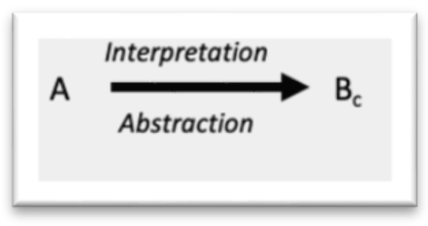
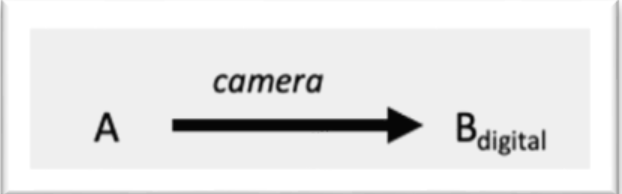
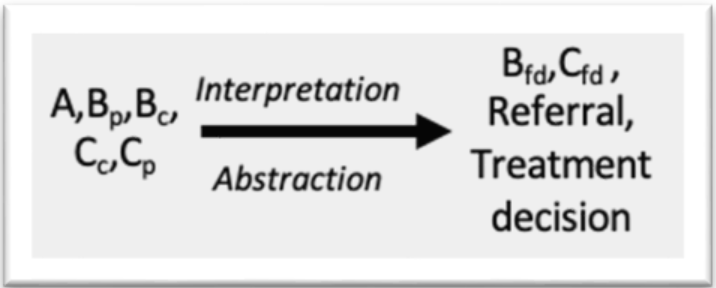
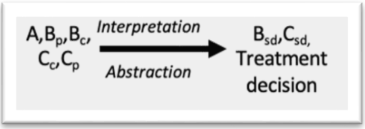
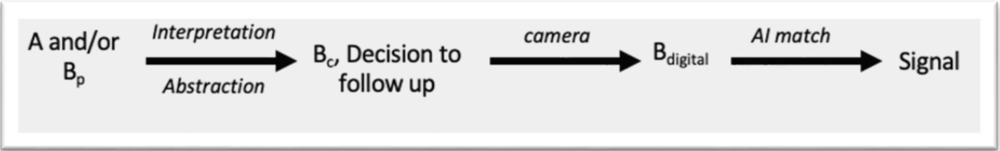
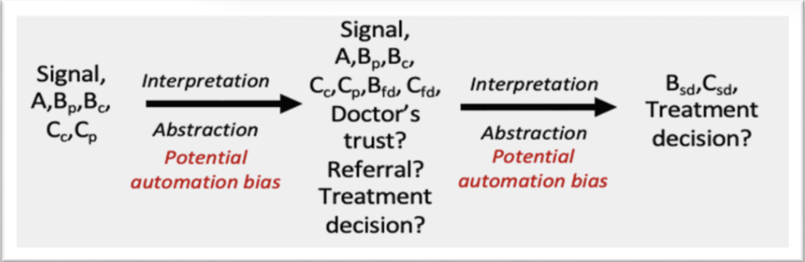

.. _hc1-context:

Introduction and background
---------------------------
There are many areas where AI can assist dermatological experts, such as computer-aided detection/diagnosis, disease prediction, image segmentation, etc. [1]_ The most successful AI applications to dermatology involve processing images and making automated decisions based on images of skin patches, e.g., distinguishing between images portraying healthy skin from images containing dermatological conditions [2]_. Dermatology is among the areas which can benefit from data-driven models, as the first step of identifying skin diseases typically consists of visual inspection (possibly followed by further analyses) and AI approaches are well-suited to classify images —if provided with sufficient training data. 

One of the greatest success stories of AI is image classification and image manipulation, in particular through data-driven approaches such as ML and Deep Learning (DL) [3]_. Computer vision boosted by DL has been employed in a variety of medical contexts, including dermatology, covering several tasks from disease classification using clinical images to disease classification using dermatopathology images [4]_, [5]_, [6]_. One of the biggest limitations of the widespread adoption of DL techniques is their data-hungry nature. Generally speaking, DL models base their success on the availability of large, annotated data sets, e.g., thousands of different images containing various examples of healthy skin and dermatological diseases. 

AI can also come to the rescue to remove this obstacle, as in recent years, great strides have been made toward synthetic medical image generation through DL approaches, [7]_ , [8]_ in particular using DL models such as Variational Autoencoders (VAEs), Generative Adversarial Networks (GANs) and Diffusion Models [9]_ . However, the majority of these data augmentation techniques —with few exceptions [10]_ , [11]_ — do not target skin images, but rather focus on MR images, PET, CT scans, radiography, etc. [12]_ Instead, synthetic generation of clinical skin images with pathology aims at generating realistic and diverse images depicting various skin conditions and pathological patterns. [13]_ , [14]_ The goal is to capture the complexity and visual characteristics of different skin conditions, including dermatological diseases, lesions, and abnormalities [15]_. 

To achieve this, researchers employ various strategies, including the incorporation of domain knowledge, data augmentation techniques, and conditioning methods that guide the generation process based on additional information or attributes. Existing approaches in the field have predominantly relied on the utilization of GANs or VAEs. These methods have proven to be effective in generating high-quality samples and learning latent representations. However, they tend to require several thousand training images to learn the features of skin with and without pathological conditions.  

For the present use case, however, we are dealing with a scarce data set of only a few hundred images taken from a public hospital in Italy (IRCCS Azienda Ospedaliero Universitaria Di Bologna). To circumvent the data scarcity, we propose to generate realistic skin images with a diffusion model [16]_ . To the best of our knowledge, there are very few approaches in the literature that employ diffusion models in this context and demonstrate their suitability even with a very small training set. The code used to implement the approach and run the experiments is publicly available. [17]_  

The goal of this use case is to develop a synthetic image generator that can generate synthetic images of skin with pathologies in a way that captures the complexity and visual characteristics of different skin conditions, including dermatological disease, lesions, and abnormalities. As in the previous chapters, we will do the development work using the guard rails created by using the FMM and the IFM methodologies. 

Fair-by-Design methodology
--------------------------

Methodology Overview
~~~~~~~~~~~~~~~~~~~~
The Fair Model Methodology (FMM) is grounded in the EU AI Act’s high-risk requirements. The FMM assists development decision-makers (DMM) during the development stage of the AI system to select and/or design a fair algorithm and model. The primary purpose is to ensure that technical, ethical, legal, and social constraints of fairness are adequately addressed through the development process. As such, for a model or an algorithm to be deemed fair it must successfully complete the following assessments:  

* **Code Audits**: assessment of the design steps, algorithmic training, and risk management tools adopted to mitigate the risk of unfairness. 

* **Process Audits**: evaluating the extent fairness principles and values are included in the process shaping the design, development, and use of the AI system. This audit entails a risk evaluation of Fundamental Rights and of social/societal impacts. 

The methodology was tested in a workshop using the AEQUITAS use case of an AI-assisted system for the identification of dermatological diseases in pediatric patients. The system is based on a transformer model trained on approximately 300 images of children with dermatological conditions, aiming to support more equitable diagnosis and reduce bias in clinical settings. A summary of the key findings and methodological validation can be found in the following sections [18]_. The full report can be found in Appendix C.1 

Key Findings
~~~~~~~~~~~~
**Model Description** 

The AI model is a Swin Transformer developed in Python by the University of Bologna for the Horizon Europe-funded AEQUITAS project. It uses dermatological images and is documented in English.  

**Model Characteristics**

The model’s intended use is pediatric skin disease prediction. While not intended for deployment in its current form, it is used to demonstrate real-world bias in models trained primarily on light skin. Despite some errors, performance may exceed that of human doctors. The design assumes that analyzing image patches is valid. The model contains 26 million parameters and 100 hidden layers. Inputs are phone-captured, non-dermoscopic images; outputs are disease classifications. Integration into clinical workflows must account for variability in model responses. Synthetic data for darker skin tones may improve performance. 

**Model Architecture** 

This section was postponed as it was deemed more relevant at the system level and requires further expert input. 

**Training details** 

Data was split 60/20/20 for training, testing, and validation. Pre-processing included anonymization, patch cropping, and exclusion of poor-quality images. Disease detection used masks with binary labelling. Due to data imbalance, augmentation was used to better represent darker skin tones. The model is supervised, with iterative feedback loops from clinicians. 

**Trustworthiness Considerations** 

A construct gap exists between masking and final labelling. Labelling bias is acknowledged as comparable to doctor-level error. Ground truth error is mitigated via final doctor validation. Bias may stem from geographic distribution, not just discrimination. Transparency is currently lacking and domain shifts (e.g. tattoos, birthmarks) are critical considerations. The addition of pigment-generated images improved accuracy for all skin tones and may alleviate privacy concerns. 

**Internal Benchmarking & Bias** 

Benchmarks are difficult to define due to domain specificity. Biases were primarily data-related, particularly underrepresentation of darker skin. 

Assessment of FMM
~~~~~~~~~~~~~~~~~~~~~
The methodology was effective in guiding fairness assessments, with questions generally relevant and aligned to the EU AI Act. However, improvements are needed in the clarity, relevance, and specificity of certain questions, particularly regarding technical terminology and contextual intent. It was also recommended to tailor questions more precisely and involve domain experts to improve applicability.

Socio-technical analysis using IFM 
----------------------------------
To create the IFM graphs and determine the scope of the IFM analysis, we performed the following steps: 

* Interview with developers and technical experts 

* Analysis of AEQUITAS material

Introduction to Socio-Technical Context: Dermatological case
~~~~~~~~~~~~~~~~~~~~~~~~~~~~~~~~~~~~~~~~~~~~~~~~~~~~~~~~~~~~
The goal of this project is to develop an AI tool that assists in diagnosing pediatric dermatological conditions. This tool is especially valuable given the high demand on healthcare services and the limited availability of specialists. In Italy’s public health system, a specialist’s diagnosis is the final step in patient care. For non-emergencies, patients first see a family doctor, who then issues a referral to a specialist. In perceived emergencies, patients go to an emergency clinic where a receptionist (often a doctor) conducts an initial assessment before directing the patient to a specialist or to more acute care. 

An AI-driven diagnostic aid could help with these initial assessments and manage patient flow, relieving pressure on specialists so they can focus on truly urgent cases. 

Because this tool is still in the exploratory phase, the scope of the IFM analysis is to evaluate its potential impacts under different implementation scenarios. Accordingly, our IFM analysis considers three layers of information inspired by the semiotic triangle: 

* **Referent (A)**: The physical patient, whose body exhibits a dermatological condition. 

* **Symbol (B)**: Various perceptions or representations of that condition, including mental models, images, or data. 

* **Concept (C)**: The resulting diagnosis or description of the patient’s condition. 

.. figure:: img/HC1_Tab7.png
  :width: 600
  :alt:  Table 7. Overview of symbols in the IFM analysis of the dermatology use case.   

  Table 7. Overview of symbols in the IFM analysis of the dermatology use case.  

We consider the following stages in the diagnostic journey as IFM networks: 

**Awareness**: The child notices discomfort or symptoms. 

**Perception**: The child creates a perception of the dermatological condition 

.. image:: img/HC1_Perception.png
  :width: 200
  :alt: Perception

**Image Capture**: A photo of the affected area is taken. 

**AI Assessment**: The image is analyzed by the AI tool. 

.. image:: img/HC1_AIassessment.png
  :width: 200
  :alt: AI Assessment
 
**Family Doctor Visit**: The child and/or guardian(s) consult their family doctor. 

**Specialist Visit**: The child and/or guardian(s) consult a dermatology specialist. 

We use the defined networks to reconstruct the following scenarios and map the impacts. 

Scenario 1: Child-Led & Guardians AI Use 
~~~~~~~~~~~~~~~~~~~~~~~~~~~~~~~~~~~~~~~~

* **Awareness & Decision to Act**: 

    * The child and/or guardians recognize skin discomfort and decide whether to pursue further investigation. 

    * Although not AI-related, the child’s age and comfort with technology may influence this choice. Similarly, the choice is affected by guardians’ comfort with technology. 

* **Image Capture & AI Input**: 

    * If the child/guardians opt to use the AI tool, they photograph the affected skin area. 

    * The digital image serves as the AI’s input. 

* **AI Signal & Next Steps**: 

    * True Positive (TP): AI correctly flags a serious condition, prompting the child and guardians to seek medical care. 

    * True Negative (TN): AI correctly indicates no serious issue, providing reassurance. 

    * False Positive (FP): AI mistakenly signals danger, potentially causing unnecessary worry or medical visits. 

    * False Negative (FN): AI fails to detect a serious condition, giving false reassurance and delaying care. 

* **Impact Evaluation**: 

    * Using the confusion-matrix framework, we focus on TP, FP, and FN outcomes to assess how child-led AI use affects healthcare decisions and potential risks or benefits. 

Follow-Up IFM for True Positives (TP) and False Positives (FP) 
^^^^^^^^^^^^^^^^^^^^^^^^^^^^^^^^^^^^^^^^^^^^^^^^^^^^^^^^^^^^^^

When a TP or FP alert occurs, our expectation is that the patient will consult their family doctor. Unlike the current workflow, the doctor now has the AI’s signal as additional information. Depending on the doctor’s trust in the AI system and their own diagnostic style, this signal can lead to: 

* **Automation bias**: Overreliance on the AI alert, leading to unnecessary referrals or treatments in FP cases. 

* **Negative reaction**: Distrust of the AI results, causing the doctor to dismiss even valid TP alerts and potentially withhold necessary referrals or treatment. 

At the specialist level, similar dynamics apply. Automation bias may overload specialists with unwarranted cases, while distrust in AI could cause them to overlook genuine TP alerts. 

Key takeaway 
^^^^^^^^^^^^
* A high FP rate can actually increase system burden —contrary to the AI’s goal of alleviating pressure— by driving unnecessary appointments and procedures. 

* Both excessive trust and excessive distrust in the AI can compromise objective diagnosis, either by creating false alarms or by discounting true warnings. 

Implications for False Negatives (FN) 
^^^^^^^^^^^^^^^^^^^^^^^^^^^^^^^^^^^^^
False negatives pose the greatest risk: patients receive false reassurance from the AI despite a serious condition. Depending on the disease, delayed or missed treatment can have severe consequences. In many cases, the condition will progress and only be detected later —either by the AI in a subsequent analysis or by a physician— at a more advanced stage, resulting in significantly worse outcomes. 

Scenario 2: AI Used by the Family Doctor 
~~~~~~~~~~~~~~~~~~~~~~~~~~~~~~~~~~~~~~~~
In this scenario, the IFM analysis parallels the TP/FP dynamics described for Scenario 1: the family doctor may exhibit automation bias —over-relying on AI alerts in FP cases— or skepticism, potentially dismissing valid TP warnings. However, false negatives carry less risk here, since a qualified physician still examines the patient and can catch missed issues through their own assessment. 

Because the doctor visit already occurs, this deployment does not meaningfully reduce system congestion. While safety improves (fewer undetected cases), the primary benefit of relieving doctors’ load is largely lost. 

Suggestions
^^^^^^^^^^^
Given the high risk of false negatives in Scenario 1 and the diminished systemic benefit in Scenario 2, we advise revisiting the project’s foundational premise (“question zero”): 

* **Reevaluate scope**: Determine whether to proceed with this AI tool at all, weighing its integration into existing clinical workflows against ethical, organizational, and social considerations and the anticipated gains. 

If decided to continue development: 

1. **Characterize error profiles**. Analyze how FP and FN rates vary by disease type and severity. 

2. **Conduct a formal risk assessment**. Establish criteria under which the AI system would be deemed acceptably safe. 

3. **Mitigation Planning for FNs**: Implement AI safeguards, such as automated messages for users to seek re‐evaluation if symptoms persist or worsen, to ensure that no serious condition goes untreated. 

Validation Reflections 
~~~~~~~~~~~~~~~~~~~~~~
* **Strength of IFM**: The IFM framework proved effective at comparing and contrasting alternative prospective system scenarios, helping us identify trade-offs early in design. 

* **Broadened perspective**: The interview process shifted the focus beyond technical functionality to include sociotechnical factors thereby deepening stakeholders’ insights into the AI tool’s potential scope and risks. 

Integration into the experimentation environment
------------------------------------------------
Building on the methodological outcomes of the FMM and the IFM analyses, the dermatological disease prediction use case was validated within the AEQUITAS Experimentation Environment. This phase aimed to operationalise the fairness principles defined during the methodological assessment by quantifying bias, applying mitigation strategies, and evaluating the results through controlled experiments. 

The experimentation directly addressed the fairness concerns raised by the FMM workshop—particularly the underrepresentation of darker skin tones in pediatric dermatology datasets—and the socio-technical risks identified through IFM, such as the potential for automation bias in diagnostic workflows and unequal performance across patient groups. 

Building on the methodological outcomes of the FMM and the IFM analyses, the dermatological disease prediction use case was validated within the AEQUITAS Controlled Experimentation Environment. This phase aimed to operationalize the fairness principles defined during the methodological assessment by quantifying bias, applying mitigation strategies, and evaluating the results through controlled experiments.   

The experimentation directly addressed the fairness concerns raised by the FMM workshop —particularly the underrepresentation of darker skin tones in pediatric dermatology datasets— and the socio-technical risks identified through IFM, such as the potential for automation bias in diagnostic workflows and unequal performance across patient groups.   

**Methodology and Metrics**
The experimentation followed the standard AEQUITAS validation protocol, using the metrics defined by the framework to measure disparities before and after mitigation:   

* Statistical Parity Difference (SPD) and Disparate Impact (DI) were used for bias detection, evaluating whether diagnostic predictions were systematically more or less favorable for certain skin tones.   

* Equalized Odds Ratio (EOR) was employed for post-mitigation assessment, measuring whether error rates (false positives/negatives) were balanced across lighter and darker skin groups.   

These metrics were applied across multiple dermatological conditions, including Iatrogenic Drug-Induced Exanthema, Urticaria, Viral Exanthema, Chickenpox, and Scabies, as shown in the fairness plots in the experimental report (see links in Table 1). The results confirmed significant performance disparities across skin color categories prior to mitigation. Models trained on the original dataset tended to favor lighter skin tones, yielding higher confidence scores and accuracy for these groups, while underperforming for intermediate and darker tones —a direct reflection of the dataset’s imbalance.   

**Mitigation Technique**
**Stable Diffusion-Based Data Augmentation**. To counter this imbalance, a Stable Diffusion-based Data Augmentation technique was implemented **(Synthetic Data Generation via AEQUITAS Image Synthesizer)**. The approach consisted of training a diffusion model capable of generating realistic dermatological images for underrepresented skin tones, preserving morphological and textural fidelity while diversifying pigmentation and illumination conditions. The generated images were then incorporated into the training dataset, thereby expanding the range of visual features available to the classifier. This mitigation method directly responds to the FMM recommendation to ensure fairness through data-level interventions and aligns with the IFM insight that fairness issues in clinical workflows often originate from imbalanced data and representational asymmetries rather than model architecture alone.   

Results and Analysis
~~~~~~~~~~~~~~~~~~~~
The results presented in the experimental report demonstrate a clear improvement in fairness metrics following diffusion-based augmentation. Disparate Impact (DI) improved consistently across all disease categories, approaching parity values (0.8–1.0) compared to pre-mitigation ranges around 0.5–0.7. Statistical Parity Difference (SPD) values decreased substantially, indicating reduced prediction skew between lighter and darker tones. Post-mitigation Equalized Odds Ratios (EOR) increased, confirming that the distribution of false positives and false negatives became more balanced across skin groups. Notably, these fairness improvements were achieved without compromising predictive accuracy, as shown by the performance plots (accuracy and F1-score). Accuracy remained above 0.85, and F1-scores showed negligible degradation after augmentation.   

Links to FbD Methodology and IFM
~~~~~~~~~~~~~~~~~~~~~~~~~~~~~~~~
The experimentation phase consolidated and validated the earlier methodological findings in three ways:   

* **From FMM to Experimentation**: The FMM workshop had highlighted fairness concerns rooted in data imbalance and lack of transparency in model behavior. The experimentation translated these conceptual risks into measurable technical indicators and verified that data augmentation grounded in fairness principles can effectively mitigate them.   

* **From IFM to Experimentation**: IFM analysis had mapped how diagnostic decisions and patient interactions could amplify or attenuate bias depending on information quality and model reliability. The improved fairness outcomes after augmentation indicate that enhanced representational balance directly contributes to reducing systemic risk in decision pathways, such as automation bias and unequal trust in AI-generated diagnoses.   

* **From Theory to Evidence**: The combined use of fairness metrics (SPD, DI, EOR) provided quantitative evidence that the model’s predictions became more equitable after augmentation, confirming the operational validity of fairness-by-design recommendations within a real clinical AI pipeline.   

Key Outcomes   
~~~~~~~~~~~~
* **Fairness enhancement through generative methods**: The Stable Diffusion-based augmentation proved effective in increasing the representational diversity of dermatological images, mitigating the bias introduced by lighter-skin dominance.   

* **Validation of fairness–performance alignment**: The model maintained high accuracy while achieving significant improvements in DI and EOR, confirming that fairness improvements can coexist with predictive reliability.   

* **Traceability to AEQUITAS methodology**: The experimentation operationalized FMM’s fairness design requirements and IFM’s socio-technical insights, demonstrating how the AEQUITAS framework can transform qualitative fairness principles into quantifiable, compliance-ready outcomes.   

* **Scalability**: The successful use of diffusion-based augmentation establishes a methodological precedent for applying synthetic data generation as a fairness instrument in other medical imaging contexts under the AEQUITAS framework.   

Use of syntetic data
--------------------
The dermatology use case heavily relied on synthetic data generation as a fairness-enabling mechanism. Because the original pediatric dataset collected in Italy was highly polarized toward lighter skin tones, it lacked sufficient representation of intermediate and darker phototypes. This imbalance limited both model generalizability and fairness, as confirmed during the FMM workshop and Information IFM analysis.   

To address this structural imbalance, the AEQUITAS Synthetic Data Generator was deployed using a Stable Diffusion-based Data Augmentation approach. The diffusion model was trained to produce realistic images of pediatric dermatological conditions across a broader range of skin tones, while preserving clinical features such as lesion morphology, texture, and disease-specific visual markers. These synthetic samples were then incorporated into the training dataset to enhance diversity and reduce representational bias.   

**Stress Testing with Polarized Data**. After augmentation, a set of stress tests was conducted using polarized datasets to evaluate the robustness and boundaries of the fairness improvements. These stress tests simulated extreme conditions by artificially altering the balance between light and dark skin categories creating maximally polarized as well as balanced variants of the dataset.   

Two main experimental setups were performed:   

* Polarized Scenario (Test–SkinDiseaseMax) – darker skin tones were severely underrepresented to reproduce the real-world bias of the unbalanced dataset.   

* Balanced Scenario (Test–SkinDiseaseBalanced) – synthetic samples were proportionally generated until representation across all skin tone categories was uniform   

The fairness and performance metrics from these tests are summarized below:   

* In the Polarized Scenario, fairness metrics degraded sharply: Disparate Impact (DI) dropped below 0.6 and Statistical Parity Difference (SPD) values became strongly negative for darker tones, confirming that even minimal underrepresentation leads to discriminatory performance.   

* In the Balanced Scenario, fairness metrics markedly improved: DI approached parity (0.9–1.0) and SPD values converged toward zero, while Equalized Odds Ratio (EOR) demonstrated that error rates across skin tones became substantially aligned   

Importantly, overall model accuracy and F1-score remained stable across both scenarios, [19]_ proving that the fairness gains did not compromise predictive performance. 

Interpretation and Methodological Links
~~~~~~~~~~~~~~~~~~~~~~~~~~~~~~~~~~~~~~~
The use of synthetic data in this experiment directly operationalized the FMM principle that fairness can be improved through fair data design and targeted augmentation. By generating missing demographic variation synthetically, the team was able to embed fairness-by-design at the data level, thereby addressing one of the main constraints highlighted in the FMM assessment.  

The results also confirmed key insights from the IFM analysis. IFM had shown that biased data representations can propagate through diagnostic workflows, leading to automation bias and unequal clinical outcomes. The synthetic balancing experiment demonstrated empirically that once representational asymmetries are corrected upstream, downstream decision risks decrease accordingly. This is a validation of AEQUITAS’ multi-layer fairness approach that connects socio-technical reasoning with algorithmic performance.   

Boundaries and Limitations
~~~~~~~~~~~~~~~~~~~~~~~~~~
The stress-testing phase also made it possible to identify the boundaries of the Stable Diffusion-based augmentation approach:   

* Performance stability deteriorates slightly when synthetic samples constitute more than 60% of the total training set, indicating a threshold beyond which oversampling introduces redundant or low-variance patterns.   

* Visual fidelity of darker-skin synthetic samples remains high for common conditions (e.g., viral exanthemas) but decreases for rare diseases with few real exemplars, leading to potential over-smoothing or color artefacts.   

* Residual disparities persist at the edges of the dataset distribution, showing that algorithmic fairness mitigation cannot fully replace the need for genuine, demographically diverse data collection.   

The use of synthetic data was critical in demonstrating that fairness can be engineered and stress-tested within a controlled experimentation framework. The Stable Diffusion-based augmentation significantly reduced bias in disease prediction across skin tones, as validated through Statistical Parity Difference, Disparate Impact, and Equalized Odds Ratio. Stress testing with polarized datasets confirmed both the effectiveness and limits of the method: fairness can be achieved and maintained under moderate imbalance, but extreme underrepresentation still requires structural interventions in data acquisition and governance.  

This experiment thus validated the AEQUITAS principle that data-level fairness, model-level fairness, and socio-technical fairness must be developed jointly, ensuring that bias is mitigated both in the model and in the ecosystem where it operates.   

Learnings and conclusions
-------------------------
The use case provided a comprehensive validation of the AEQUITAS framework within the healthcare domain, demonstrating how fairness-by-design principles can be systematically applied to medical imaging AI. By integrating the FMM, IFM, and the Controlled Experimentation Environment, the case showed how ethical, socio-technical, and technical perspectives can jointly ensure equitable AI-assisted diagnostics.  

The FMM played a key role in identifying fairness risks during the model design phase. The workshop confirmed that data imbalance —specifically the underrepresentation of darker skin tones in pediatric dermatology— was the primary driver of unfair outcomes. It also highlighted the need for transparency in model design, traceability of dataset composition, and explicit documentation of performance variations across subgroups. The FMM findings established that fairness could not be achieved solely through model tuning; it required targeted interventions at the data-collection and augmentation stages.  

The IFM complemented this by situating these technical risks within the broader clinical workflow. The IFM analysis revealed that biased diagnostic outputs can propagate through multiple layers of human–AI interaction: from the child’s or guardian’s initial reliance on AI recommendations to the physician’s interpretation of automated results. The model showed that automation bias —whether through overreliance or excessive skepticism— could magnify disparities in care if AI outputs are systematically less accurate for certain skin tones. The IFM thus established the socio-technical pathways through which data and model bias could translate into real-world clinical inequality.  

The AEQUITAS Controlled Experimentation Environment operationalized these insights into measurable, empirical validation. Using fairness metrics such as Statistical Parity Difference (SPD), Disparate Impact (DI), and Equalized Odds Ratio (EOR), the experiments quantified the disparities predicted by FMM and IFM analyses. The results confirmed that models trained on the original dataset favored lighter skin tones, with marked differences in predictive performance across phototypes. To mitigate this, a Stable Diffusion-based Data Augmentation strategy was implemented, generating realistic synthetic dermatological images for underrepresented skin tones.  

The augmented models showed substantial improvements in fairness metrics —DI values approaching parity (0.8–1.0), reduced SPD values, and more balanced EOR distributions— without any loss of diagnostic accuracy. This demonstrated that generative AI can serve as a powerful fairness enabler when used responsibly, augmenting representation in data-scarce clinical domains. Stress testing with polarized datasets further validated these improvements while revealing the operational boundaries of the approach. The fairness gains persisted under moderate imbalance but began to deteriorate when minority representation dropped below critical thresholds (approximately 5% of the dataset). This confirmed both the robustness and the limits of synthetic augmentation, echoing the FMM’s and IFM’s warnings that algorithmic fairness cannot replace structural data equity.  

The cumulative outcome of this use case is the demonstration of AEQUITAS as a full-lifecycle fairness assurance framework in healthcare AI:  

* **From methodology to experimentation**: FMM provided the design-time structure for fairness auditing; IFM exposed bias pathways in socio-technical contexts; the controlled experimentation environment verified and mitigated these biases empirically.  

* **From qualitative risks to quantitative evidence**: AEQUITAS translated fairness concerns from ethical and legal language into measurable technical outcomes using established fairness metrics.  

* **From data to governance**: The Stable Diffusion-based augmentation showed that fairness can be engineered at the data level, while IFM reinforced that sustainable fairness also requires governance mechanisms—human oversight, interpretability, and context-sensitive deployment.  

In conclusion, the dermatology use case validated AEQUITAS’ capacity to link ethical design, socio-technical modelling, and experimental validation into a single, coherent fairness-by-design workflow. The approach demonstrated that bias mitigation through generative augmentation can substantially enhance equity in medical AI, provided that it is guided by transparent governance and continuous monitoring. Through this multi-layer validation, AEQUITAS delivered a concrete methodology for developing trustworthy, equitable, and regulation-ready AI tools in the healthcare sector.  

Experimenter Reports
--------------------
See the detailed `reports <https://github.com/aequitas-aod/aequitas-doc/tree/main/usecase-hc1-dermatology/reports/best-solution>`_ of the usecase. 

Design Process History - A Transparent Approach
-----------------------------------------------
In the following sections we show a list of preliminary experiments (on various areas) that we have conducted to refine the design of the experimenter. We show this history of our tentetives for the sake of increasing the transparency of the design process.

* `Bias Detection <https://github.com/aequitas-aod/aequitas-doc/blob/main/usecase-hc1-dermatology/preliminary%20tests/HC1_Bias_Detection.pdf>`_

* `Full Experimentation Pipeline within AEQUITAS <https://github.com/aequitas-aod/aequitas-doc/blob/main/usecase-hc1-dermatology/preliminary%20tests/HC1_Full_Experimentation_Pipeline.pdf>`_

.. rubric:: References

.. [1] Kim, M., Yun, J., Cho, Y., Shin, K., Jang, R., Bae, H.j., Kim, N.: Deep learning in medical imaging. Neurospine 16(4), 657 (2019)
.. [2] Wells, A., Patel, S., Lee, J.B., Motaparthi, K.: Artificial intelligence in dermatopathology: Diagnosis, education, and research. Journal of Cutaneous Pathology 48(8), 1061–1068 (2021)
.. [3] Chai, J., Zeng, H., Li, A., Ngai, E.W.: Deep learning in computer vision: A critical review of emerging techniques and application scenarios. Machine Learning with Applications 6, 100,134 (2021)
.. [4] Brinker, T.J., Hekler, A., Utikal, J.S., Grabe, N., Schadendorf, D., Klode, J., Berk- ing, C., Steeb, T., Enk, A.H., Von Kalle, C.: Skin cancer classification using convolutional neural networks: systematic review. Journal of medical Internet research 20(10), e11,936 (2018)
.. [5] Chan, S., Reddy, V., Myers, B., Thibodeaux, Q., Brownstone, N., Liao, W.: Ma- chine learning in dermatology: current applications, opportunities, and limitations. Dermatology and therapy 10, 365–386 (2020)
.. [6] Göç̧eri, E.: Convolutional neural network based desktop applications to classify dermatological diseases. In: 2020 IEEE 4th International Conference on Image Processing, Applications and Systems (IPAS), pp. 138–143. IEEE (2020)
.. [7] Wen,Y.,Chen,L.,Deng,Y.,Zhou,C.:Rethinkingpre-trainingonmedicalimaging. Journal of Visual Communication and Image Representation 78, 103,145 (2021)
.. [8] Thambawita, V., Salehi, P., Sheshkal, S.A., Hicks, S.A., Hammer, H.L., Parasa, S., Lange, T.d., Halvorsen, P., Riegler, M.A.: Singan-seg: Synthetic training data generation for medical image segmentation. PloS one 17(5), e0267,976 (2022)
.. [9] Chlap, P., Min, H., Vandenberg, N., Dowling, J., Holloway, L., Haworth, A.: A review of medical image data augmentation techniques for deep learning applications. Journal of Medical Imaging and Radiation Oncology 65(5), 545–563 (2021)
.. [10] Bhadula, S., Sharma, S., Juyal, P., Kulshrestha, C.: Machine learning algorithms based skin disease detection. International Journal of Innovative Technology and Exploring Engineering (IJITEE) 9(2), 4044–4049 (2019)
.. [11] Ghorbani, A., Natarajan, V., Coz, D., Liu, Y.: Dermgan: Synthetic generation of clinical skin images with pathology (2019)
.. [12] Kebaili, A., Lapuyade-Lahorgue, J., Ruan, S.: Deep learning approaches for data augmentation in medical imaging: A review. Journal of Imaging 9(4), 81 (2023)
.. [13] Jaworek-Korjakowska, J., Yap, M.H., Bhattacharjee, D., Kleczek, P., Brodzicki, A., Gorgon, M.: Deep neural networks and advanced computer vision algorithms in the early diagnosis of skin diseases. In: State of the Art in Neural Networks and Their Applications, pp. 47–81. Elsevier (2023)
.. [14] Li, Z., Koban, K.C., Schenck, T.L., Giunta, R.E., Li, Q., Sun, Y.: Artificial intelligence in dermatology image analysis: current developments and future trends. Journal of Clinical Medicine 11(22), 6826 (2022)
.. [15] Barhoumi,W.,Khelifa,A.:Skinlesionimageretrievalusingtransferlearning-based approach for query-driven distance recommendation. Computers in Biology and Medicine 137, 104,825 (2021)
.. [16] Borghesi, A., Calegari, R. (2024). Generation of Clinical Skin Images with Pathology with Scarce Data. In: Shaban-Nejad, A., Michalowski, M., Bianco, S. (eds) AI for Health Equity and Fairness. Studies in Computational Intelligence, vol 1164. Springer, Cham. https://doi.org/10.1007/978-3-031-63592-2_5. 
.. [17] https://github.com/aequitas-aod/experiment-gen-skin-images. 
.. [18] Unfortunately, due to time constraints, the FMM was only partially applied to the use case. 
.. [19] See p11-12 of the Experimenter report.
