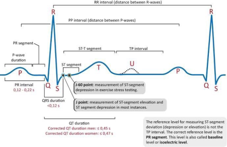

.. _hc2-context:

Introduction and background
---------------------------
Electrocardiograms (ECG) are the gold-standard in medicine for an overall and finegrained assessment of the condition of the heart. The deflections in the so-called PQRST complex that represents a single heartbeat are connected to the sequence of contractions of the heart muscle. Deviations in those deflections are directly tied to cardiovascular diseases like (ventricular) arrhythmia, myocarditis, myocardial fibrosis, or even inherited or acquired defects. Classification of ECG traces as symptomatic or normal is typically done by experts. AI Algorithms trained on existing data can be used to automate this process. However, these training data may suffer from various forms of bias which in turn are entrained into the resulting AI algorithm.

Since its discovery and invention in 1902 by Willem Einthoven, the electrocardiogram (ECG or EKG) has become the main staple of any diagnostic procedure in hospitals, whether the suspected diagnosis is directly related to cardiac symptoms or whether other symptoms may be at play. The main benefit of the ECG is that it enables non-invasive recording of the electrical activity of the heart, and visualizing or storing the heart’s beats in a format that can be read and interpreted by trained physicians.
The interpretation is based on recognizing the various components of the so called PQRST complex that comprises a single heartbeat. The PQRST complex has been called as such ever since Einthoven’s description of the ECG signal. The sequence of waves is directly related to polarization and depolarization of the various structural parts of the heart and their role and position in the sequence of a single heartbeat. For instance, the R-wave is the largest because it represents the depolarization of all ventricles. Given its size it is easiest to detect and is typically used to determine the interbeat interval (the time between beats as visualized by the RR interval in :numref:`Figure %s <stylized-ecg>`) which in turn is used to compute heart rate as the number of beats per minute.

    Stylized representation of the ECG's PQRST(U) complex. Figure from https://ecgwaves.com/topic/ecg-normal-p-wave-qrs-complex-st-segment-t-wave-j-point/

Although the general public typically only knows about the typical ECG shape as visualized in :numref:`Figure %s <stylized-ecg>`, clinicians actually (typically) use 12 individual leads (ECG sensors) and track the progression of a specific wave over time across the leads to glean more information to support their diagnostic purpose. For instance, changes in the deflection of the P-wave on leads II and V1 are known to be indicative of hypertrophy [#]_.

That such relations between (changes in) ECG deflections and symptoms exist for many people is largely due to the DNA homogeneity of the human population: It has been estimated [#]_ that only 0.1% of our DNA varies. Despite that homogeneity, it has been observed that ECG morphology, for instance aspects like the duration and voltage of the QRS complex, varies between different ethnic populations [#]_ [#]_ . Similarly, there is evidence that ECG abnormalities vary between ethnic populations. For instance, in the US it was observed that people with European ancestry have a higher prevalence of atrial fibrillation [#]_  despite having lower risk factors than underrepresented ethnic groups [#]_.

Based on these observations, it is clear that bias in ECG may exist, for instance due to sampling procedures, and needs to be considered when using ECG data to train (AI) algorithms. As one example, it is known that between the genders, considerable differences: women have higher mortality, more symptoms, and higher rates of recurrence after ablation procedures against atrial fibrillation. Women present differently compared to men when suffering from myocardial infarction, and their bodies react to and process medication differently than males do [#]_. Additionally, with the physiological changes in the body, it is known that ECG signals are different between the younger and older population [#]_. Moreover, also comorbidities have been shown to affect the ECG signal to some degree [#]_.

It is clear that reading and scoring of ECG is prone to various biases also affecting the diagnostic process. In the present day, such diagnostic processes are often supported by AI algorithms and we should be careful not to incorporate these biases in the training of such algorithms. For that reason, it is important for developers of algorithms for scoring and classifying ECG signals to have a diversity of data available to ensure that their algorithms can be readily used in a diverse range of scenarios without compromising on the efficacy of the algorithm to determine the correct outcome.

One way to deal with bias and unbalance in data is to use synthetic data to complement or replace the original data. For ECG, typically, one of three approaches is used: mathematical modeling, computer-vision techniques, or deep-learning approaches [#]_. For this use case, we have developed a confidential algorithm to generate synthetic ECG traces to support the development of AI algorithms for ECG classification in all aspects. The ECG signal generator can create healthy/normal ECGs for multiple leads and add noise to the signal from a diverse range of sources to represent real-life scenarios involving faulty or misplaced ECG leads. Beyond the normal ECGs, the algorithm can also generate symptomatic ECGs with specific configurations to create signals with a range of type and severity of the symptoms. A sample of these synthetic ECGs has been made available to interested parties in the Aequitas consortium for further analysis.

.. _hc2-goal:

Goal
----

To build a bias-aware algorithm for the classification of ECG traces as normal or symptomatic.

.. _hc2-method:

Method
------

We will first investigate methods that are suited to generate synthetic ECG data with or without deliberately introduced bias. Once the ECG synthetic data, with one or more deliberately introduced (additional) biases is available, the data will be used to determine whether a Philips proprietary solution is sensitive to bias. This solution evaluates ECG traces to classify, beat by beat, whether the beats are normal or affected by disease. Due to bias in the original training data these evaluations can be biased as well. To this end, PRE will use the Aequitas experimentation platform on premises to validate this use case.

.. rubric:: References

.. [#] https://ecgwaves.com/topic/ecg-normal-p-wave-qrs-complex-st-segment-t-wave-j-point/

.. [#] L. B. Jorde, S. P. Wooding, Genetic variation, classification and ‘race’, Nature Genetics 36 (2004) S28–S33.

.. [#] I. A. Mansi, I. S. Nash, Ethnic differences in electrocardiographic intervals and axes, Journal of Electrocardiology 34 (2001) 303–307.doi:10.1054/jelc.2001.27453.

.. [#] E. W. Hancock, B. J. Deal, D. M. Mirvis, P. Okin, P. Kligfield, L. S. Gettes, Aha/accf/hrs recommendations for the standardization and interpretation of the electrocardiogram: Part v: Electrocardiogram changes associated with cardiac chamber hypertrophy: A scientific statement from the american heart association electrocardiography and arrhythmias committee, council on clinical cardiology; the american college of cardiology foundation; and the heart rhythm society, Circulation 119 (3 2009). doi:10.1161/CIRCULATIONAHA.108.191097.

.. [#] K. Hebert, H. C. Quevedo, L. Tamariz, A. Dias, D. L. Steen, R. A. Colombo, E. Franco, S. Neistein, L. M. Arcement, Prevalence of conduction’abnormalities in a systolic heart failure population by race, ethnicity, and gender, Ann Noninvasive Electrocardiol 17 (2012) 113–122.

.. [#] U. R. Essien, J. Kornej, A. E. Johnson, L. B. Schulson, E. J. Benjamin, J. W. Magnani, Social determinants of atrial fibrillation, Nature Reviews Cardiology 18 (2021) 763–773. doi:10.1038/s41569-021-00561-0.

.. [#] M. J. Legato, P. A. Johnshon, J. E. Manson, Consideration of sex differences in medicine to improve health care and patient outcomes. JAMA (2016) E1-E2.

.. [#] http://doi.org/10.1515/JBCPP.2011.017.

.. [#] https://pmc.ncbi.nlm.nih.gov/articles/PMC9267325/.

.. [#] https://www.sciencedirect.com/science/article/pii/S0010482524015385.
