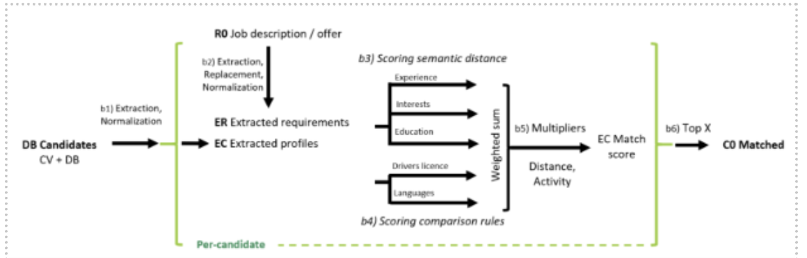
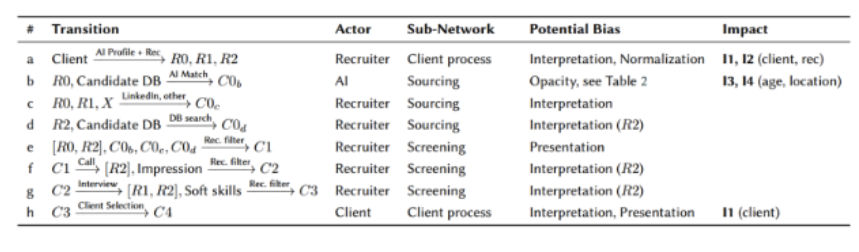
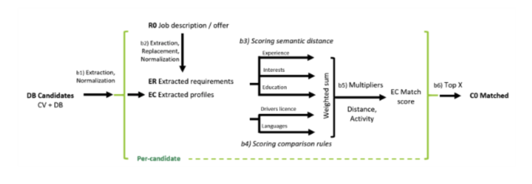
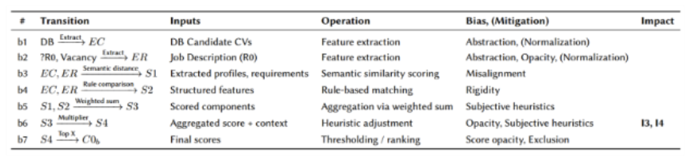

.. _hr1-context:

Introduction and background
---------------------------
This case study analyzes a specific software used by the Adecco Group in the candidate selection process. The software supports the recruitment process by recommending the best candidates for a given job position and, conversely, suggesting the most suitable positions for candidates. 

At the core of the software is a recommendation engine powered by AI, which extracts relevant information from candidates’ resumes and standardizes it against structured data stored in the internal database. By comparing the candidates’ attributes with the requirements of the job position, the software generates a ranked list of candidates based on their compatibility. The results are then presented to the recruiter. 

Following this, the shortlisted candidates are personally evaluated by the recruiters and, if deemed suitable, proposed to the relevant companies. 

Additionally, the software provides access to a dataset composed of anonymized data, collected over a specific period (e.g., a snapshot of a single day’s operation). This dataset includes the matches proposed by the software, enriched with candidates’ information such as age, gender, geographic location, education, and the specific job positions requirements. 

The aim of this case study is to target the cognitive and structural bias that might be associated with existing assisted hiring systems. The analysis of the tool will make it possible to detect and assess possible biased outcomes resulting from the algorithm/software and the human expert in the selection of candidates. 

.. _hr1-known:

Known biases and unfairness  
~~~~~~~~~~~~~~~~~~~~~~~~~~~
In the context of the Adecco Group’s use of automated recruiting software, particularly for Adecco Formazione, several biases and potential unfairness may arise. First, algorithmic bias can occur if the training data embedded in the software system is not representative of the diverse applicant pool, leading to skewed selection processes that favor certain demographics over others based on age, gender, geographic location, and educational background. Additionally, if the software disproportionately recommends candidates from specific regions or with certain educational credentials, it may inadvertently marginalize equally or more qualified candidates from other backgrounds. 

Fair-by-Design – Fair Data Collection, Governance and Management methodology 
----------------------------------------------------------------------------
The FbD methodology applied in the Adecco use case followed the same structure as in Akkodis. Through workshops coordinated by ALLAI, the recruitment dataset and the recommendation tool were assessed against the principles of the EU AI Act. The analysis confirmed similar challenges to those observed in Akkodis, including unbalanced demographic representation, risks of proxy discrimination, and the need to account for intersectional fairness, while also addressing the specific context of a commercially deployed recommender system. 

Socio-technical analysis using IFM 
----------------------------------
Introduction to IFM
~~~~~~~~~~~~~~~~~~~
This use case examines a real-world recruitment process that combines human decision-making with AI-assisted tools. The process begins when a client organization specifies its staffing needs to a recruitment firm, which prepares a job description. An AI tool supports this step by helping to structure and standardize the description. The firm then identifies potential candidates through a mix of manual sourcing and the use of an AI Matching tool. Candidates are drawn from a proprietary database, online platforms, and direct outreach. The AI Matching tool ranks database candidates based on semantic and rule-based similarity to the job profile, after which recruiters review, interview, and shortlist candidates before presenting a final selection to the client. Throughout this workflow, multiple actors—clients, recruiters, and AI systems—interact in ways that continuously transform, filter, and interpret information. This creates a complex socio-technical structure where outcomes are shaped jointly by human judgement and algorithmic recommendations, and where risks of bias and discriminatory impact can emerge at several points. 

IFM Model and Table 
~~~~~~~~~~~~~~~~~~~~~
The following figures and tables present the formalized IFM of the recruitment process at two interconnected levels of abstraction. Figure 6 gives an overview of the entire recruitment workflow, highlighting key stages from client input to final candidate selection. Table 4 details each transformation in this flow, specifying responsible actors, potential biases, and identified stakeholder impacts. The AI Match channel can be found described in greater detail in Figure 7. 

  
  Figure 6. FM Overview of the Adecco recruitment process. In the green dashed box the top-level client-process can be seen. The “Outsourced” arrow points to the larger image containing the orthogonally connected Sourcing and Screening IFM models.

  Table 4. Description of channels (a)-(h) in Figure 6

  Figure 7. This figure shows a more detailed IFM of the AI Matching channel. 

  Table 5. Details on channels (b1)-(b7) in Figure 7

Figure 7 zooms in on the AI Matching component—a sub-network within the broader process—showing the internal steps of feature 	extraction, matching, scoring, and ranking. Table 5 accompanies this sub-network with a breakdown of the AI transformations, the data involved, and the associated sources of bias or mitigation. 
Together, these models illustrate how decision-relevant information is transformed through both human and algorithmic steps, providing the structural basis for the following bias and impact analysis. 

IFM Analysis 
~~~~~~~~~~~~
The recruitment process at Adecco involves multiple human and algorithmic transformations, each of which may introduce, propagate, or mitigate bias. The Information Flow Model (IFM) provides a structured way to trace these possibilities by mapping how specific channels transform information, and how those transformations influence decisions relevant to stakeholders. 

Bias Analysis 
^^^^^^^^^^^^^
The results of this analysis are summarized in the Bias columns of Table 4 and Table 5. The analysis reveals that bias can arise in several forms across the process and then propagate downstream. 

At the earliest stage, abstraction and interpretation already create potential distortion. In channel (a), client requirements are transformed into job descriptions and technical requirements (R0 and R1) by recruiters, supported by an AI tool. The tool partly mitigates biased formulations by normalizing client language, thereby reducing the propagation of gendered terms into R0 and R1. However, the recruiter’s own understanding (R2), which informs several downstream steps, is not subject to the same mitigation. As such, recruiter interpretations may still encode implicit assumptions about candidate suitability. 

The AI Matching system (channel b) represents another critical site of potential bias. It transforms information through feature extraction, semantic similarity, scoring, and ranking. As shown in Table 4, these transformations carry risks of bias but also include mitigation efforts. For example, normalization of language in both candidate CVs and job requirements helps reduce gendered-language bias before semantic scoring. At the same time, additional sources of bias are introduced: for instance, the rule-based scoring algorithm includes a distance modifier that systematically reduces scores for candidates living further from the employer. 

Transparency also emerges as a challenge. Sub-scores generated in intermediate steps (b3, b4) are not displayed to the recruiters, a design decision intended to reduce confusion. Yet this opacity limits explainability and may create an “explainability bias”, where the system functions differently from the recruiter’s mental model. In such cases, intentional system use may yield unexpected outcomes because the logic is not transparent to its users. 

Impact Analysis
^^^^^^^^^^^^^^^
While bias describes structural misalignments in the decision process, **impact concerns the real-world consequence for candidates**. The IFM enables these downstream impacts to be traced back to specific transformations, clarifying how certain steps may disproportionately disadvantage particular groups. 

The analysis identifies four potential discriminatory outcomes: 

* **O1: Gender-based discrimination in hiring.**  Some risks are mitigated by removing gendered language in job descriptions, but recruiter interpretations (R2) and final client selection (h) remain vulnerable to implicit bias. Interestingly, gaps in career experience—typically a gender proxy—are not captured by the AI Matching system. Instead, recruiters often infer seniority from age, creating a related bias (I3: age favoritism). 

* **O2: Exclusion of candidates with non-standard or nonlinear career paths.** The AI Matching tool does not explicitly penalise nonlinear experience and may even favour candidates with diverse paths. However, recruiter judgement and sourcing practices may reintroduce this bias. 

* **O3: Penalty for non-native language use or unrecognised institutions.** While the AI tool does not use institution names directly, recruiter evaluation may still disadvantage candidates from less well-known universities or with weaker linguistic alignment. 

* **O4: Location-based favoritism.** The explicit distance modifier in scoring creates a systematic disadvantage for candidates living in remote or less populated regions. This structural factor may intersect with socioeconomic or ethnic disparities, amplifying inequities (I4). 

**Summary of Bias–Impact Paths**

* **I1:** Client-driven discrimination (channel h)
* **I2:** Recruiter interpretation and filtering (channels a–g)
* **I3:** Age-based bias via seniority proxy (b5–g)
* **I4:** Location-based disadvantage (b6)

These findings illustrate how bias can propagate—or be blocked—depending on both system design and actor behavior. The IFM model makes these structures explicit, supporting targeted assessment and future design improvements. 

Suggestions
~~~~~~~~~~~
The analysis identified one directly structural path of discrimination, namely the location-based bias introduced by the distance modifier in the scoring system. We recommend that this feature be removed or redesigned. A possible alternative would be to develop location-sensitive models that treat geographic constraints as explicit technical requirements, only applying them when they are demonstrably necessary for a given vacancy. Simulations using synthetic data could help reveal unintended or unintuitive effects of these design choices. 

The analysis also showed that existing mitigative effects are effectively sidelined, as they do not shape recruiters’ intuitive understanding of the process. To address this, guidelines on gender equality should be more explicitly integrated into the selection process and reinforced through regular monitoring. Logging recruiter reasoning would also create a valuable feedback mechanism to trace decision patterns over time. 

To avoid adverse effects of explainability bias, we suggest that the AI tool’s sub-scores be presented alongside the final ranking. This would enable recruiters to understand and critically evaluate the AI results, facilitate error-checking, and align human heuristics with algorithmic outputs. Crucially, it would also strengthen accountability pathways. 

Validation reflections
~~~~~~~~~~~~~~~~~~~~~~
The pre-model interviews (Step 1) proved highly effective in building the initial IFM scaffold, though some areas required clarification through follow-up questions. This highlighted the value of interviewing multiple stakeholders with overlapping domains, as subsequent sessions can then more efficiently target missing areas and reveal variability. For optimal results, we recommend at least two overlapping interviews or a verification session post-modelling. 

The IFM modelling framework was able to represent all relevant structures encountered in this use case. The orthogonal models and the equivalence between networks and channels proved particularly useful, enabling intuitive nesting and simplification of otherwise complex relationships. 

The deliberate separation of bias and impact, a key principle of IFM, worked as intended. It facilitated structured reasoning about how mitigation measures operate and how different biases contribute to downstream discriminatory effects—something difficult to achieve with classical algorithmic fairness approaches or AI FRIAs. 

In post-modelling validation interviews, use-case representatives regarded the IFM model as accurate and directly useful. They saw clear potential for the model to support both internal communication (e.g., raising awareness of bias pathways) and practical analysis of discrimination risks. The bias and impact analysis was also found credible and prompted stakeholders to elaborate on suspected dynamics, thereby confirming and enriching the findings. 

The exercise also enabled productive engagement with external stakeholders, including a union representative and a human rights activist from Period Think Tank. These participants challenged some framing choices—particularly IFM’s non-normative definition of bias—but acknowledged the model’s value in surfacing socio-technical issues. 

Finally, feedback on the explanatory materials (graphical presentation and methodological guide) pointed to the need for clearer glossaries, more detailed presentation formats, and stronger structures to mitigate modeler bias. Stakeholders also suggested explicitly naming intersectional discrimination within the guide materials. This feedback is highly valuable for refining the IFM methodology and ensuring its broader applicability. 

Integration into the experimentation environment
------------------------------------------------
To complement the legal, ethical, and socio-technical analyses conducted through the FbD methodology and the IFM modelling, the Adecco use case was tested in the AEQUITAS Controlled Experimentation Environment. This phase aimed to translate the risks identified in the workshops—particularly those relating to gender, age, and geographic provenance—into measurable outcomes, using fairness metrics and algorithmic mitigation techniques. 

In line with the Akkodis case, the following fairness metrics were applied: Statistical Parity Difference, Disparate Impact, Equalized Odds Ratio, and Demographic Parity Ratio. These metrics were computed before and after mitigation to capture both the extent of algorithmic bias and the effectiveness of corrective strategies. 

The experimentation directly operationalized findings from the FbD analysis (dataset imbalance, proxy risks) and the IFM socio-technical model (bias introduction in recruiter interpretation, geographic scoring adjustments). Sensitive attributes flagged upstream —particularly sex and age buckets— were included as fairness dimensions in the experimental evaluation. 

Mitigations
~~~~~~~~~~~
Three mitigation strategies were trialled:

* Correlation Remover (pre-processing) to address structural correlations between sensitive attributes and other features.

* Prejudice Remover (in-processing) to penalise biased outcomes during training.

* Adversarial Debiasing (in-processing) to learn fair representations by jointly optimising predictive accuracy and fairness objectives

Results
~~~~~~~
The experiments confirmed that Adversarial Debiasing consistently delivered the best trade-off between fairness improvement and model performance. As shown in the performance plots, [1]_ accuracy and precision remained stable after mitigation, while fairness metrics such as Demographic Parity Difference and Equalized Odds Difference improved significantly. [2]_ 

Stress testing with synthetic polarized datasets [3]_ further validated this result. Under conditions of extreme demographic imbalance, Adversarial Debiasing maintained higher fairness levels than alternative methods, although performance declined when minority groups became too underrepresented —a finding that echoes the IFM insight that location- and provenance-related disadvantages cannot be fully corrected at algorithmic level without upstream data governance interventions. 

Key Outcomes
~~~~~~~~~~~~
* The FbD findings on dataset imbalance were confirmed quantitatively: unbalanced representation of subgroups (e.g., gender × region) systematically affected outcomes. 

* The IFM results on location-based disadvantage were validated: distance-related features propagated structural bias into model outputs. 

* Adversarial Debiasing emerged as the most effective mitigation technique, reducing disparities across sensitive groups while preserving predictive utility. 

* Stress tests demonstrated both the robustness and the limits of mitigation: fairness algorithms improve outcomes substantially, but extreme imbalances still require data-level interventions. 

In summary, the experimentation phase showed that fairness-aware algorithmic interventions can operationalize the normative and socio-technical findings of the Adecco use case. Among the tested approaches, Adversarial Debiasing proved to be the most reliable, offering a practical pathway for Adecco to integrate fairness into its recruitment recommender systems. 

Use of synthetic data
---------------------
Synthetic data were employed to stress test the robustness of the mitigation strategies, with a focus on Adversarial Debiasing, which had emerged as the most effective approach. By deliberately polarizing subgroup distributions and simulating extreme imbalances, the experiments helped identify the breaking points of the model.  

Results confirmed that while Adversarial Debiasing substantially improved fairness under realistic conditions, its effectiveness diminished in scenarios of extreme underrepresentation —reinforcing the conclusion from the FbD and IFM analyses that data-level governance and representativeness remain indispensable alongside algorithmic mitigation. 

Assessment Alternative Assessment: CV Screening & Keyword Matching
------------------------------------------------------------------

Introduction & Problem Statement
~~~~~~~~~~~~~~~~~~~~~~~~~~~~~~~
In this supplementary experiment, we assessed how the LLM-based CV screening and keyword matching component used by Adecco might introduce bias in candidate ranking and matching. The goal was to evaluate whether this modern NLP tool amplifies or mitigates fairness risks, especially with regard to gender and other sensitive features. 

The study was structured around a resume parsing bias detection. The pipeline explores how natural language-derived features from CVs are extracted, normalized, matched to job postings, and ultimately used in similarity scoring and ranking. The analysis highlights where bias may occur in each transformation, and measures how mitigation may reduce disparity. 

Pipeline & Methodology
~~~~~~~~~~~~~~~~~~~~~~~
The pipeline is organized in several stages: 

1. Problem framing & data collection  

    * The input consists of CV text and job description text. 

    * Sensitive attributes (e.g. gender) and candidate metadata (education, location, etc.) are known and can be used to evaluate disparity. 

    * The pipeline operates under the assumption that downstream matching and ranking decisions are influenced by the representation learned from CV text. 

2. Processing & model pipeline 

    * Textual features are extracted from CVs and job descriptions (e.g. embeddings, keyword representations). 

    * Normalization / preprocessing is applied (e.g. lowercasing, tokenization, removal of gendered tokens). 

    * Matching and similarity scoring layers compute a compatibility score between the candidate and job posting. 

    * The ranking of candidates is produced based on this score. 

3. Evaluation & bias measurement 

    * The system is evaluated on fairness metrics comparing top-N selections or ranking outcomes across protected groups. 

    * Bias is quantified both before and after mitigation steps (e.g. to see how much disparity is reduced). 

The results examine how gendered language, token normalization, and ranking perturbations affect disparity. Throughout, the authors build analyses of where bias is likely to creep in—via language encoding, tokenization, implicit associations, or scoring heuristics—and test whether mitigation steps help. 

Key Findings & Results
~~~~~~~~~~~~~~~~~~~~~~
From the published results: 

* Term asymmetry: Words such as “nurse,” “engineer,” or domain-specific terms have gendered associations and connotations that are unevenly distributed across CVs and job postings, producing semantic mismatches that systematically disadvantage certain genders. 

* Stereotypical associations: The model tends to favor candidates whose CVs contain more “neutral” or historically male-leaning language, reinforcing existing biases in how professions are linguistically framed

* Similarity scoring bias: Candidates whose CVs conform more closely to canonical templates (e.g. highly structured language) often receive stronger similarity scores, while those with less conventional or varied wording may be penalized. 

* Effectiveness of mitigation: Mitigation approaches, such as neutralizing gendered tokens or normalizing keyword distributions, significantly reduce disparity in ranking outcomes without entirely harming utility. Disparate Impact and statistical parity discrepancy were improved post-mitigation, though residual gaps remained. 

* Trade-offs and limits: The mitigation does not completely equalize outcomes, especially in subgroups with fewer samples. Some bias remains in edge cases or underrepresented classes. 

These findings indicate that **LLM-based CV processing can introduce or magnify biases through latent linguistic associations**, but also that targeted neutralization techniques can alleviate them albeit only partially. 

Limitations & Future Directions
~~~~~~~~~~~~~~~~~~~~~~~~~~~~~~~
Some caveats to consider: 

* The dataset is a snapshot (e.g. a day of predictions), not a full longitudinal history, so bias dynamics over time are not captured. 

* The mitigation experiments are limited to token-level / normalization changes; more advanced debiasing (e.g. adversarial fairness, distributional debiasing) would be worth exploring. 

* Intersectional breakdowns (e.g. gender × nationality) suffer from small sample sizes, reducing statistical power in subgroup fairness testing. 

* Because the tool is only part of a larger human + AI pipeline, the real-world fairness impact depends on how recruiters use and override recommendations. 

Learnings
---------
The Adecco use case provided the opportunity to validate the AEQUITAS framework on two distinct but complementary fronts: a structured recruitment dataset processed through traditional ML pipelines, and an LLM-based CV screening tool used to extract and match candidate information. Together, these exercises enabled a comprehensive evaluation of fairness risks in both conventional AI and emerging NLP/GenAI systems. 

From the first experiment, focused on structured data, the analysis confirmed that imbalanced representation of sensitive attributes (gender, age, geographic provenance) and proxy features (e.g., location, education) significantly affect recruitment outcomes. The experimentation phase demonstrated that while several mitigation strategies improved fairness, Adversarial Debiasing emerged as the most effective, achieving a stable balance between fairness gains and predictive performance. Stress tests with synthetic data highlighted, however, that no algorithm can fully compensate for extreme underrepresentation, reinforcing the need for robust data governance and collection practices. 

The second experiment, centered on the LLM-based CV screening tool, revealed that linguistic asymmetries and stereotypical associations can skew candidate–job matching. Gendered terms and conformity to conventional CV formats were shown to systematically influence similarity scores. Mitigation strategies such as neutralizing gendered tokens and normalizing keyword distributions reduced disparities but did not eliminate them entirely. This underscored the risk that modern NLP components may replicate or even amplify structural inequalities if not carefully monitored. 

The unified outcome of these exercises is the validation of the AEQUITAS methodology across different technological paradigms. The same Fair-by-Design and IFM principles that guided the structured data analysis also proved applicable to a generative/NLP setting, confirming the generality and adaptability of the framework. Moreover, the controlled experimentation environment successfully operationalized fairness concerns into measurable metrics across both contexts, demonstrating that AEQUITAS can serve as a pre-regulatory instrument for diverse AI technologies. 

For Adecco, the overall learning is twofold. First, fairness-aware AI in recruitment requires a dual focus: strong dataset governance combined with algorithmic mitigation. Second, the methodology must extend to modern language technologies, where fairness risks emerge not only from data imbalance but also from linguistic representation and model opacity. By validating AEQUITAS on both fronts, Adecco has gained practical evidence that fairness can be systematically embedded in recruitment technologies—traditional and generative alike—thus aligning future development with both ethical standards and regulatory requirements. 

Design Process History - A Transparent Approach
-----------------------------------------------
In the following sections we show a list of preliminary experiments (on various areas) that we have conducted to refine the design of the experimenter. We show this history of our tentetives for the sake of increasing the transparency of the design process.

* `Preliminary Analysis <https://apice.unibo.it/xwiki/bin/download/Aequitas/Deliverables/ADECCO_Data_Analysis.pdf>`_

* `Data Pre-processing <https://apice.unibo.it/xwiki/bin/download/Aequitas/Deliverables/ADECCO_preprocessing.pdf?rev=1.1>`_

* `Bias Detection <https://apice.unibo.it/xwiki/bin/download/Aequitas/Deliverables/ADECCO_Bias_Detection.pdf>`_

* `Bias Mitigation <https://apice.unibo.it/xwiki/bin/download/Aequitas/Deliverables/ADECCO_Bias_Mitigation.pdf>`_

.. rubric:: References

.. [1] See page 15 of the Experimenter report.

.. [2] See page 16 of the Experimenter report.

.. [3] Pages 24 and 32 of the Experimenter report.