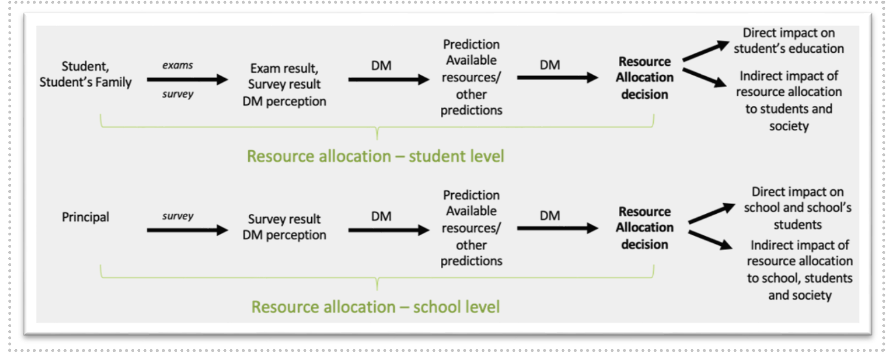
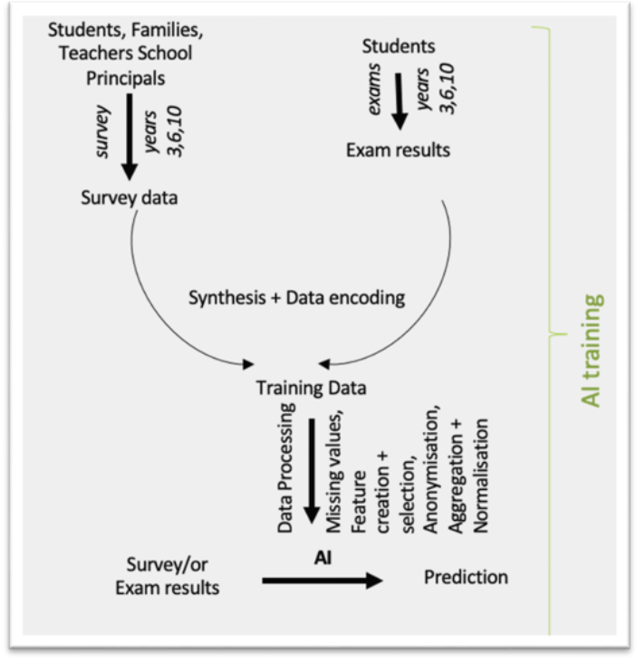
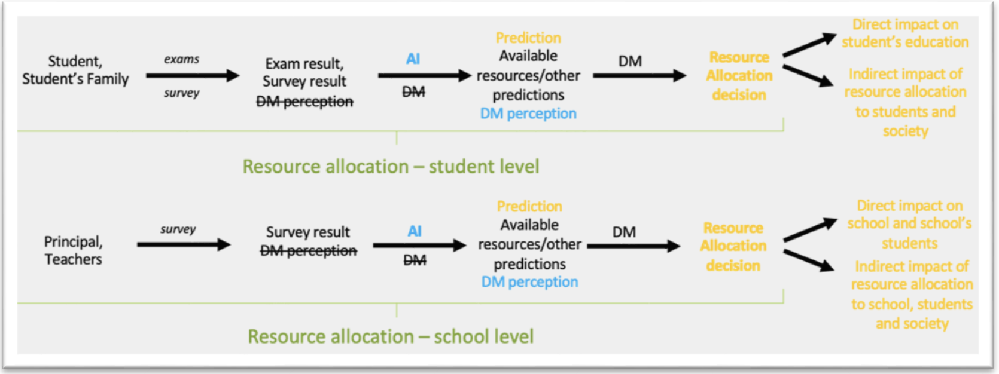
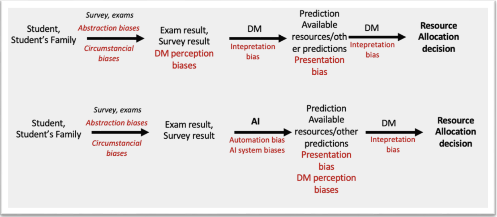
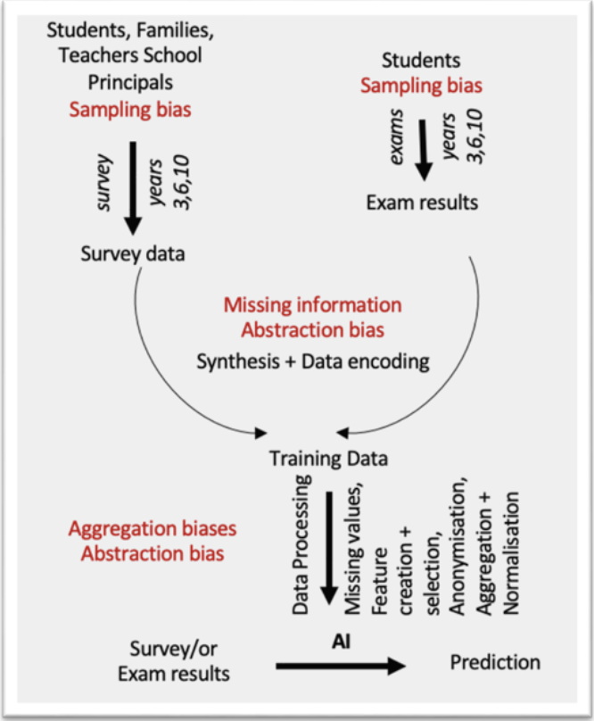

.. _s2-context:

Introduction and background
---------------------------
The use case is motivated by the importance of academic performance in primary and secondary education, as it is a strong predictor of an individual’s future income and overall well-being. In this context, AI-based predictive models have great potential to identify students who are at risk of failing academically and those who are performing exceptionally well. These models could be valuable in designing early intervention programs aimed at preventing academic failure or fostering academic excellence. However, it is crucial that these models are not only accurate but also fair, ensuring that predictions do not systematically prejudice certain demographic or socioeconomic groups. The data originates from the Canary Agency for University Quality and Educational Evaluation (Agencia Canaria de Calidad Universitaria y Evaluación Educativa, ACCUEE), a public institution in the Canary Islands responsible for monitoring the quality of educational services in the region by collecting data on students, curricula and schools. These raw data have undergone filtering, cleaning and other pre-processing steps to produce the dataset used in this project. 

The data on students includes information on their academic performance in Mathematics, Spanish and English, as well as responses to questionnaires from students, families, teachers and school principals. These questionnaires attempt to capture the socio-economic and cultural background of the students, as well as the situation of their schools.  

Data was collected from students in the third and sixth grades of primary education and the fourth grade of secondary education. This process was repeated over four academic years, from 2015–16 to 2018–19. The dataset is organized in a table with 83,857 rows and 554 columns. The columns represent the various features that have been collected for each student, while each row corresponds to an individual student at a particular grade level and academic year. However, the actual number of distinct students is lower than 83,857, since data are collected for the same students at multiple time points. Students enrolled in Year 3 (primary education) during the 2015–16 academic year, for example, are observed again in Year 6, thus providing longitudinal data. This longitudinal structure enables us to analyze individual educational trajectories over time.  

.. list-table:: Observations
   :header-rows: 1
   :class: blue-header

   * - **Education**
     - **Grade**
     - **2015-16**
     - **2016-17**
     - **2017-18**
     - **2018-19**
   * - Primary Education
     - 3rd grade
     - 20430 
     - 3202
     - 3290 
     -
   * - Primary Education
     - 6th grade 
     - 20711 
     - 3237 
     - 3301 
     - 19855
   * - Secondary Education
     - 4th grade
     -
     - 3132
     - 3291 
     - 3408 

Furthermore, data on primary education for the 2015–16 and 2018–19 academic years were obtained through a comprehensive census of the entire student population. For other grade levels and academic years, data were collected via sampling procedures. The number of observations for each grade and academic level is detailed Table 6.

The database includes detailed information on various aspects of the educational system. The variables are divided into five categories: 

* Information about the student scores in Mathematics, Spanish Language and English (tests).  

* Information about students (student questionnaire – 154 variables).    

* Information about the school characteristics (school principal questionnaire – 138 variables) 

* Information about the student’s family (family questionnaire – 91 variables), mainly relating to the student’s household’s socioeconomic conditions.  

* Information about the teacher (teacher questionnaire – 158 variables). Only for primary education.   

In this use case, academic performance is the target variable, and some of the explanatory variables are classified as sensitive. Academic performance is measured by student scores in Mathematics, English and Spanish. These scores are available in two different formats, allowing for multiple analytical approaches. Firstly, the data includes a continuous variable consisting of standardized scores ranging from 0 to 1000, with an average of 500 points and a standard deviation of 100 points. This format supports regression analysis, enabling precise examination of performance variation across individuals. On the other hand, academic performance is also expressed as a categorical variable based on objective criteria established by ACCUEE, which classifies students into four performance levels. 

* **LOW:** below 400 points 

* **MEDIUM:** between 400 and 500 points 

* **HIGH:** between 500 and 600 points 

* **ADVANCED:** above 600 points 

This categorical format enables the analysis to be approached as a classification problem, facilitating the identification of distinct student profiles based on academic achievement. 
.. _hr2-senstive features:

Sensitive features
~~~~~~~~~~~~~~~~~~
The sensitive variables in our use case come from three different questionnaires: 

* **Student Questionnaire:** This questionnaire collects sensitive information about the student’s sociodemographic and academic background. This includes details such as their gender, birth country, nationality, whether they have repeated a school year, and the type of studies they plan to pursue the following year. 

* **School Principals Questionnaire:** This questionnaire asks for information about the school, such as its location and whether it is public or private. 

* **Family Questionnaire:** These sensitive variables relate to information about the student’s family, especially their socioeconomic conditions, including the educational level of both parents, their employment status, place of birth, how many books they have at home, their educational expectations for their children, their occupation, monthly household income and their Economic, Social and Cultural Status (ESCS) index. 

Known biases and unfairness  
~~~~~~~~~~~~~~~~~~~~~~~~~~~
Several of the potential prejudices inherent in our use case may result in inequitable outcomes when machine learning algorithms are implemented. These include: 

* **Sampling Bias:** Some students were unable to attend school on the day of the assessments, and some did not complete the questionnaires. These students usually come from disadvantaged backgrounds, which implies an underrepresentation of lower-class households or low-performing students in the sample. 

* **Selection Bias:** Neither students nor teachers are randomly assigned to schools. Instead, more motivated parents and teachers select better schools, which creates self-selection issues (endogeneity). This can result in schools' value-added being biased, as better performance may be driven by the presence of better students and teachers. 

* **Family Questionnaire Bias:** In each year group, a high percentage of students (around 20–40%) have no information about their family background due to non-response to the family questionnaire. Non-response may be correlated with certain student characteristics, such as low academic achievement, gender, place of residence or immigrant status. Making decisions without addressing this bias could result in unfair predictions and discrimination against certain groups. 

* **Missing Data Bias:** Almost every variable in the database has missing values. These missing data may correlate with sensitive student features (e.g. socioeconomic background), which could introduce systematic bias and affect the fairness of model predictions. 

* **Context Transfer Bias:** Using machine learning models trained in one region in another region may result in unfair or inaccurate outcomes due to contextual differences. Similarly, using historical data (e.g. from Year 4) to predict future academic performance (e.g. in Year 7) can introduce bias if the context or relevant conditions change over time.

.. _hr2-context:

Fair-by-Design – Fair Data Collection, Governance and Management methodology 
----------------------------------------------------------------------------

Methodology Overview
~~~~~~~~~~~~~~~~~~~~

The TAIRA framework is a 7-step methodology to evaluate whether an AI system should be developed and whether it is trustworthy. It aims to answer “question zero” in AI: not only how, but if AI should be used [1]_ . TAIRA is applied in the early scoping phase of the AI lifecycle and integrates ethical, legal, and socio-technical perspectives. 

The steps include: 

1. Stating the problem 

2. Defining the solution 

3. Identifying stakeholders and relevant factors 

4. Assessing the solution against the Ethics Guidelines for Trustworthy AI (EGTAI) 

5. Ethical testing of the AI solution 

6. Comparing and choosing the best solution 

7. Reflecting and documenting the process 

This methodology was tested in a multidisciplinary workshop using the AEQUITAS use case: AI-assisted identification of disadvantaged students. The upcoming sections provide a brief overview of the key findings and methodology assessment. The full in-depth findings discussion can be found in [ ANNEX NAME] of this report. 

.. _hr2-method:

Key Findings
~~~~~~~~~~~~
The workshop brought together technical, legal, ethical, and policy experts to collaboratively test TAIRA. The first two steps were pre-filled based on the use case, and participants engaged with steps 3–7: 

During **Stakeholder Identification (Step 3)** participants identified four main stakeholder groups relevant to the AI use case: Affectees (students, society, schools), Decision-Makers (developers, deployers, principals, public authorities), Domain Experts (teachers, ombudsmen, national education bodies), and AI Users (teachers and possibly students). Their roles (responsible, co-responsible, expert) across the six AI lifecycle stages were mapped on a stakeholder map. 

The main points discussed during the **EGTAI Assessment (Step 4)** were: 

* *Human oversight*: The AI system only provides recommendations, but human oversight should be maintained 

* *Technical robustness and safety*: Participants questioned whether higher accuracy leads to more fairness, highlighting that predictions can be accurate but reflect historic patterns of discrimination 

* *Privacy and data governance* : The use of socio-economic data triggered concerns about child protection and discriminatory outcomes. 

* *Transparency*: Participants emphasized traceability, audit trails, and documentation, as well as the need to mitigate automation bias. 

* *Diversity, non-discrimination and fairness*: Participants noted that it was possible to mitigate bias at the data level and that the challenging part of bias mitigation would be the algorithm.    

* *Societal and environmental wellbeing*: The AI system could reinforce discrimination, leading to a reduced opportunity for education. 

* *Accountability*: Ways to implement traceability throughout the lifecycle were discussed. 

**Step 5** involved **ethical testing**. During the harm test, the group agreed the system could be helpful if paired with policy interventions. In the publicity test, participants anticipated that parents and teachers would have concerns around fairness and bias. The virtue and professional tests surfaced shared values around equity and opportunity but also doubts about how well those values would be embedded in the system's logic. 

In **Document (Step 6)** and **Reflect (Step 7)** participants discussed how TAIRA could be used to compare multiple options. The methodology was found to be intuitive and practical. Participants highlighted the need for non-technical interventions and said that the system for the education use case would be ethically acceptable if it was transparent, bias free and provided feedback and redress mechanisms to parents and students. 

Assessment of TIARA
~~~~~~~~~~~~~~~~~~~
Participants found TAIRA to be a clear, structured, and valuable tool for ethical reflection early in the AI lifecycle. It successfully facilitated cross-disciplinary dialogue and helped surface both technical and societal risks. The main area for improvement was that the workshop assessed only one AI solution; TAIRA would be most effective when used to compare multiple AI and non-AI alternatives to avoid defaulting to technological solutions. 

Fair-by-Design – Fundamental Rights Impact Assessment (FRIA)
------------------------------------------------------------

Methodology Overview
~~~~~~~~~~~~~~~~~~~~
The Fundamental Rights Impact Assessment for AI fairness (FRIA-F) focuses on systematically identifying, assessing, and mitigating risks that AI systems may pose to fundamental rights. It is rooted in the AI Act's risk-based approach and grounded in the Charter of Fundamental Rights of the EU (ECFR).  

The methodology employs an "if-this-then-that" logic through reverse engineering. Participants are given design or implementation triggers of the AI system, then assess how these may violate fundamental rights such as dignity, equality, education, and non-discrimination as defined within the ECFR. Next, they propose mitigation strategies.  A multi-disciplinary workshop was held to apply the FRIA-F to the AEQUITAS use case of AI-assisted identification of disadvantaged students. The findings and the methodological assessment of the workshop are summarized below, while the full workshop report can be found in Appendix B.2.

Key Findings
~~~~~~~~~~~~
**Human Dignity (Art. 1)** was flagged in multiple triggers. Participants stated that using the AI system without human oversight risks dehumanizing students, reducing them to data points. Dignity was also at risk if the system was used at critical decision points like advancement or program placement without proper transparency and safeguards. 

**Non-Discrimination (Art. 21)** risks emerged from data handling and training methods. Normalization techniques and the inclusion of sensitive characteristics were flagged as necessary for detecting bias but potentially discriminatory if misused. These risks also intersected with other rights, such as **Cultural, Religious and Linguistic Diversity (Art. 22), Equality Between Women and Men (Art. 23), and Integration of Persons with Disabilities (Art. 26)**. 

**Right to Education (Art. 14)** was affected by most triggers. Participants noted that relying on historical test scores as predictors might reproduce inequality without accounting for socio-economic disparities. They also warned that system outputs may vary systematically across demographic groups. The absence of mechanisms for students or parents to challenge decisions was also seen as a risk to this right.  

Participants proposed mitigation techniques to triggers that affected fundamental rights. These included transparency measures, human review mechanisms, dataset audits, and limiting the collection of unnecessary or invasive personal data. They also stressed the importance of ensuring outputs are interpretable and challengeable, particularly in high-stakes decisions.  

Overall, participants noted that FRIA-F assessments require both technical and non-technical transparency. Without insight into how a system actually functions, risk identification becomes speculative and incomplete. Multidisciplinary collaboration is essential for meaningful FRIA implementation, and human oversight, transparency, and participatory mechanisms are necessary conditions for fairness. 

Assessment of FRIA
~~~~~~~~~~~~~~~~~~~~~
The FRIA-F exercise revealed that the methodology is best suited for later stages of AI development, when system-level details such as data processing, model architecture, and outputs are available. In this workshop, the limited technical visibility of the AI-based education tool constrained participants’ ability to assess triggers or propose meaningful mitigation strategies. Much of the discussion remained speculative, focusing on hypothetical risks rather than concrete system behaviors. Participants recommended improvements such as pre-workshop preparation time, clearer structuring of questions by development phase, as well as expanding questions beyond technical triggers to include socio-technical aspects such as user interaction and decision-making contexts. 
.. _hr2-exp:

Socio-technical analysis using IFM 
----------------------------------

Method
~~~~~~
To create the IFM graphs and determine the scope of the IFM analysis, we performed the following steps: 

* Interview with Technical Decision-maker from the ‘education tool’ provider 

* Analysis of AEQUITAS material for the use case 

* Additional information seeking from external sources 

Socio-Technical Context: Disadvantaged students 
~~~~~~~~~~~~~~~~~~~~~~~~~~~~~~~~~~~~~~~~~~~~~
From a decision-making standpoint, the core issue is one of resource allocation: decision makers must decide how to distribute a finite pool of primarily financial resources among competing interventions. Broadly speaking, these fall into three categories: 

* **Support for socioeconomically disadvantaged students**, which includes educational materials, as well as subsidized school meals. 

* **Enrichment for high-achieving students**, covering curriculum adaptations, additional opportunities, and extracurricular courses for those identified as gifted. 

* **Academic remediation for underperforming students**, providing small-group tutoring or extra after-school courses and similar programs to boost core skills. 

Educational materials and school meals (Point 1) are not within the scope of the use case. To the best of our understanding, the selection of interventions for points 2 and 3 is guided by individual student results from the ACCUEE diagnostic assessments, which make up the ACCUEE dataset. In addition, decisions on whether additional courses or workshops will take place are performed on the school level. 

To model how an AI-driven tool and additional system biases might affect stakeholders we will construct IFM graphs representing both the current resource-allocation landscape and the developers’ envisioned future system. 

IFM model of current decision-making process 
^^^^^^^^^^^^^^^^^^^^^^^^^^^^^^^^^^^^^^^^^^^^

  Figure 8. Current decision-making process in the S2 disadvantaged students use case. 

Figure 8 illustrates the current decision-making process. “DM” (Decision Maker) is a broad label for anyone responsible for choosing or authorizing an intervention; we use it to reflect uncertainty about specific roles. Within this category, we distinguish: 

* **Direct-contact DMs** (e.g., teachers, tutors, counselors) who interact personally with the student. 

* **Indirect-contact DMs** (e.g., administrators, policy makers) who make decisions based on reports or aggregates, without one-on-one contact. 

Both groups form perceptions (consciously or subconsciously) about a student’s needs and likely performance. These perceptions feed into predictions about whether the student will benefit from extra support. The primary outcome of this process is an improvement (or decline) in the student’s academic performance, but we can also evaluate broader impacts using a confusion-matrix framework and the **Fundamental Rights Impact Assessment (FRIA)** introduced earlier: 

* **True Positive / True Negative** These outcomes align with the system’s purpose: needed support is provided (True Positive), or unnecessary support is withheld (True Negative). 

* **False Positive** Resources are allocated to a student who does not require them. 
  
  * **Individual level**: In isolated cases, the waste of support may be negligible. 
  
  * **School level**: Repeated false positives can divert funding away from truly needy students, jeopardize scheduled courses, and harm the school’s reputation. In a context of limited resources, this misallocation can starve other programs of essential funding. 

* **False Negative** A student who genuinely needs help does not receive it. Under the FRIA, this outcome implicates multiple fundamental rights: 
  
  * **Right to Education (Article 26 UDHR; Article 27 Spanish Constitution)**: Denying support undermines the student’s entitlement to free, quality primary education. 
  
  * **Right to Non-Discrimination (Article 2 UDHR; Article 14 ECHR)**: If under-support occurs disproportionately for certain groups (e.g., based on socioeconomic status or learning difficulties), it may constitute indirect discrimination. 
  
  * **Right to Personal Development**: Failing to address learning needs can impair a child’s cognitive and social growth. 

  * **School level impact**: Repeated false negatives can suppress overall achievement metrics, reduce class-level performance, and weaken a school’s case for additional funding or programs. Over time, this may erode institutional capacity to serve all students equitably, compounding rights violations across the entire student body. 

IFM model of prospective situation involving AI 
^^^^^^^^^^^^^^^^^^^^^^^^^^^^^^^^^^^^^^^^^^^^^^^
This scenario is based on the development of an AI system that aims to forecast future academic performance based on data from the grade-3 cohort. This approach enables identifying students in need for additional support like remedial teaching or enrichment. Figure 9 illustrates the AI-training pipeline designed by the development team. As mentioned before, the longitudinal ACCUEE dataset —spanning the 2015–16 through 2018–19 cohorts and including more than 83,000 student-grade observations (grades 3 & 6 of primary and grade 4 of secondary, i.e. 10th grade in K–12)— forms the basis of the workflow.  

  Figure 9. AI-training pipeline used by the development team.  

Raw records combine: 

* **Standardized test scores** (Mathematics, Spanish, English) available both as continuous values (0–1000) and a discrete 4-level performance indicator. 

* **Survey data** from four sources: students (154 items), families (91), teachers (158, primary only), and principals (138), covering socio-economic and school-environment factors. 

Before data processing, data is encoded based on ACCUEE classification for survey results and data encoding. Subsequent data processing includes: 

1. **Missing‐Data Handling**: Missing entries are classified as MNAR (Missing Not at Random), MCAR (Missing Completely at Random), or MAR (Missing at Random). Depending on category, appropriate imputation strategies are applied, ensuring that gaps are filled without introducing bias. 

2. **Feature Creation**: Related items are aggregated by their mean values to yield more interpretable, consolidated variables. 

3. **Feature Selection**: Any features that duplicate information or contribute minimal insight are removed —selection is guided by semantic review, Pearson correlations with the performance targets, and feature‐importance metrics (e.g. Gini index). 

4. **Normalization**: All numerical features —including test scores and newly created aggregates— are scaled (for example, Min–Max normalization) so that they share a common range and remain comparable. 

5. **Synthesis & Anonymization**: Records are reconciled across years and grades to ensure structural consistency. An anonymization process then removes any personally identifying details, rendering the dataset safe for model training. 

The final cleaned dataset —554 features per student‐timepoint— is passed to the AI model. By exposing the model only to the grade-3 snapshot (demographics, test results, and engineered features), the development team trains it to forecast later academic performance and thereby flag, at an early stage, students who may benefit from remedial support or enrichment. With the availability of the AI system, Figure 10 shows the expected placement of the AI tool in the decision-making process based on the IFM model of the original process (see Figure 8). 

  Figure 10. Expected placement of the AI tool in the decision-making process  with blue indicating elements that were added to the previous IFM and orange denoting the expectation of information change due to the AI addition.   

The expected impact of the AI tool can be expressed as the changes that are due to the introduction of AI in the prospective system as compared to the current situation (or system). The expected impacts can be classified in the same structure of a confusion-matrix with a FRIA as used for the current situation (see Section 4.4.2.1). What changes is the quantity of these False Negatives and False Positives, which is influenced by the potential introduction of biases in the system. These biases (at the student level only) are visualized in Figure 11 for the original situation in Figure 8 and prospective setup in Figure 10.  

Abstraction biases can occur when the questionnaire answers fail to capture or inappropriately group contextual information about students or their families. For example, limited answer choices may force complex situations into oversimplified categories. In addition, when humans make decisions, they interpret situations based on their own lens and past experiences, leading to potential misinterpretations or "interpretation bias" regarding the real circumstances around students and their performance. Finally, “presentation bias” can occur when a list of students flagged for support influences decision-makers simply through how it is displayed —for example, students appearing at the top of the list may receive disproportionate attention, or visual highlighting may make certain cases seem more urgent than they actually are. 

For the sake of completeness, Figure 12 details the AI system biases coming from the training of the AI tool. Because these biases have been discussed in other use cases, we will not reiterate them here. 

  Figure 11. Biases in current and prospective systems per channel type on the student level. 

  Figure 12. Overview of biases per step of the AI-training pipeline. 

**AI-Related Biases**
Sampling bias in the AI system’s exam results arises because only a subset of courses is evaluated, so the model never sees the full picture of each student’s performance. Moreover, certain types of information (like subjective perception) is inherently hard to quantify, but we also observe that other key quantitative metrics are simply missing leading to “missing information bias” and further “abstraction bias”.  

For instance, the purpose of this sociotechnical system is to identify and address emerging issues early in students’ education by providing timely support. It assumes, first, that early interventions are effective. Secondly, to our understanding, such interventions are already being implemented in the Canary Islands schools. Yet neither of these elements are reflected in the training data. This has two major consequences: 

* **We cannot assess whether past interventions actually improved performance**, losing insights that could be relevant for the system’s main premise. 

* **We lack records of which students received interventions**, potentially omitting a critical factor in later academic outcomes and undermining the AI’s predictive accuracy. 

**Non-AI Systemic Biases**

Even without AI, as explained before, relying solely on exam scores to evaluate or predict academic achievement introduces circumstantial biases tied to exam timing and student conditions. The standardized test format itself embeds abstraction biases that may obscure a student’s true potential. Decision makers (DMs) who interpret those scores may further introduce subjective biases, whether based on personal interactions with students or impressions of school environments.  

Once an AI system is in play, automation bias can occur humans may over-trust or under-filter algorithmic recommendations. Furthermore, in all scenarios (AI-assisted or not) comparing individual or school results against peers or benchmarks can give rise to presentation bias, which can skew final judgments. 

Suggestions
~~~~~~~~~~~
Based on our analysis, we recommend the following actions: 

* **Track intervention data**. Record which students receive specific interventions to enable outcome measurement and continuous improvement. 

* **Clarify roles and responsibilities**. Define who makes decisions at each stage and establish accountability measures to prevent automation bias.

* **Investigate potential profiling**. The combination of biases and training processes in the AI suggests the system may be engaging in profiling, which is a practice prohibited under the AI Act. Further analysis is needed to confirm whether profiling is occurring and to identify necessary mitigations. 

Validation reflections
~~~~~~~~~~~~~~~~~~~~~~

Applying the IFM method to this use case revealed one notable strength and one key challenge: 

* **Strength:** The IFM framework’s granularity exposed critical gaps in the AI training dataset, highlighting missing information essential for bias detection and mitigation. 

* **Challenge:** The methodology lacks a mechanism to incorporate temporal dynamics into its analysis. Understanding whether this limitation is a theoretical limitation or whether it can be improved in future versions is important for future IFM applications.

Integration into the experimentation environment
------------------------------------------------

To operationalize the findings from the Fair-by-Design workshops (TAIRA and FRIA) and the IFM socio-technical modelling, the use case was executed in the AEQUITAS controlled experimentation environment. The objective was twofold: (i) quantify fairness risks highlighted during the methodology phases with standard technical metrics; and (ii) test mitigation strategies that reflect the socio-economic mechanisms surfaced by IFM (e.g., school context, study time, parental education), thereby closing the loop between normative analysis and empirical validation. The experimental corpus comprised the longitudinal ACCUEE dataset, pre-processed and structured for model training and evaluation as detailed in the project’s experiment report.  

Metrics
~~~~~~~

We measured group fairness with Statistical Parity Difference (SPD), Disparate Impact (DI), Equalized Odds Ratio (EOR), and Demographic Parity Ratio (DPR) to provide comparability with established practice and to quantify pre-/post-mitigation effects. In addition —and directly inspired by FRIA’s emphasis on legally relevant context and IFM’s identification of where and how information is transformed— we adopted and implemented Conditional Demographic Disparity (CDD).  

CDD extends classical demographic disparity by conditioning the fairness assessment on a socio-legal context variable (e.g., study time, parental education, school setting), aligning the measurement with how discrimination risks materialize in practice. We used both the pointwise CDD and its compact aggregation (FairRateCDD) to summaries the proportion of threshold-based classifiers that meet a given fairness tolerance, including the regression extension via discretization to evaluate continuous predictions. This addition makes fairness analysis sensitive to context (as required for compliance), improves interpretability for reviewers, and avoids misleading aggregate-only conclusions.  

We opted to use CDD because the TAIRA and FRIA analyses showed a need a) to account for socio-economic circumstances in fairness evaluation (e.g., ESCS, parental education, school ownership) and b) to provide legally interpretable evidence when judging disparate treatment. Furthermore, the IFM analysis identified where context enters (e.g., the transformation from raw diagnostics to allocation decisions) and which variables plausibly mediate impact (study behavior, parental background, school characteristics).  

CDD uses precisely these contexts as conditioning variables, turning qualitative pathways into quantitative tests. The CDD metric does so by explicitly conditioning disparity on these contextual factors, producing disparity metrics that are easier to defend because the contextual factors that could also explain the disparity have been accounted for.  

Mitigation strategies
~~~~~~~~~~~~~~~~~~~~~
We validated three families of interventions reflecting increasing alignment with the socio-economic reading of fairness that emerged in the methodology phase: 

* Correlation Remover (pre-processing) to attenuate linear dependence between sensitive attributes and features before training; 

* Learned Fair Representations (LFR) to learn embeddings that obfuscate protected information while preserving task signal; 

* Socio-economic residualization [2]_ (co-designed with economists) as our **new method** that first explains outcomes using circumstance variables (e.g., ESCS, parental education, immigration background) and then trains on the residual (the component attributable to individual “effort”), thereby aligning statistical learning with the Inequality of Opportunity doctrine. This approach operationalizes “fairness through awareness” (explicitly modelling circumstances to control their influence) and directly connects AI fairness with policy-relevant IO fairness.  

Key outcomes
~~~~~~~~~~~~
* **Context matters**: CDD indicated markedly lower disparities compared to the unconditioned DD/SPD and the share of “fair” classifiers (FairRate) rose substantially once context like study time was considered. Conditioning on this context changed fairness conclusions as anticipated by the socio-technical analysis. This observation corroborates FRIA’s requirement to assess risks within relevant social contexts rather than only in aggregate.  

* **Best method**: across SPD/DI/EOR/DPR and CDD, the residualization (IO-aligned) method delivered the best fairness–utility trade-off, reducing group gaps without unacceptable accuracy loss, and doing so in a way that is normatively defensible under equality-of-opportunity principles (i.e., it neutralizes the contribution of circumstances while preserving effort-related signal).  

* **Legal-readiness of CDD**: by transforming contextual equality into a quantitative metric (with classification and regression treatments, plus aggregation), the evaluation produces compliance-ready artefacts (plots and FairRateCDD numbers) that regulators and institutional reviewers can interpret without reverse-engineering modelling pipelines. This implements the methodology’s call for auditability and ties directly to IFM’s mapping of where decisions are formed.  

The following illustrative results (from the experimental report and CDD study) support these key findings. At the start, the ULL experiments document the feature space (e.g., parental education, books at home, school ownership) and the derived decision labels used in training and evaluation. In CDD analyses, conditioning on study time increased the fraction of classifiers that met fairness criteria relative to unconditioned DD/SPD; similarly, conditioning on parents’ education altered both within-group and between-group disparity patterns, avoiding misleading aggregate inferences —precisely the behavior IFM anticipated when context mediates impact pathways.  

Traceability and governance outcomes 
~~~~~~~~~~~~~~~~~~~~~~~~~~~~~~~~~~~~
From start to finish of the analyses, the controlled experimentation environment produced: (i) pre/post mitigation fairness dashboards for SPD, DI, EOR, DPR; (ii) CDD plots and FairRateCDD tables conditioned on study time and parental education; (iii) model cards that document dataset lineage, sensitive and contextual variables, mitigation choices and parameterization, and the fairness–accuracy trade-offs for each method. Together, these artefacts instantiate the FbD principles (TAIRA/FRIA) and the IFM logic in a reproducible, audit-friendly form, providing the evidence needed to justify design decisions and to monitor fairness over time.  

By combining standard metrics (SPD, DI, EOR, DPR) with CDD —and by privileging a residualization strategy that encodes equality-of-opportunity— the experiments demonstrate that fairness validation can be both technically sound and normatively grounded. The result is a policy-ready workflow in which risks are identified in context (IFM/FRIA), translated into measurable targets (classic metrics and CDD), and are mitigated with methods that reflect the underlying socio-economic theory of unfairness. 

Use of syntetic data
--------------------
To complement the fairness evaluation and validate the robustness of the mitigation strategies, the AEQUITAS Synthetic Data Generator was employed to conduct a series of stress tests using polarized datasets. These experiments were designed to reproduce and amplify the most critical biases detected through the FbD analysis and the IFM, particularly those related to socio-economic disparities, sampling bias, and contextual dependence. 

In line with the fairness metrics used in the main experimentation phase —Statistical Parity Difference, Disparate Impact, Equalized Odds Ratio, Demographic Parity Ratio, and the newly introduced CDD— synthetic datasets were deliberately polarized to simulate extreme imbalances. For instance, subgroups defined by parental education, household income, or study-time distributions were systematically under- or over-represented, reflecting the demographic distortions observed in real data. These stress tests served two complementary objectives. First, they allowed the research team to evaluate the resilience of mitigation algorithms —notably Correlation Remover, Learned Fair Representations, and the new socio-economic residualization method co-developed with economists— under highly unbalanced conditions. Second, they provided an empirical means of identifying the boundaries of model fairness, determining where the chosen algorithm ceases to maintain acceptable performance and equity levels. 

Results confirmed that the socio-economic residualization approach remained the most stable and effective, even under severe polarization. It preserved predictive accuracy while maintaining low disparities across all fairness metrics, including CDD. However, when subgroup representation dropped below approximately 5 % of the population, the method’s capacity to enforce fairness constraints began to deteriorate. This outcome is consistent with theoretical expectations and the IFM’s warning about data-scarcity amplification loops. Beyond this threshold, fairness improvements plateaued and statistical noise increased, underscoring that algorithmic correction alone cannot substitute for representative data.  

These findings clearly delineate the operational boundaries of fairness mitigation within educational AI systems. While AEQUITAS’ methods —especially the residualization strategy— can robustly counter moderate to high levels of bias, extreme demographic polarization requires upstream action at the data-collection and governance level, as foreseen by both TAIRA/FRIA and IFM. The synthetic-data exercise therefore provided critical validation that fairness assessment and mitigation must operate jointly with continuous data-quality monitoring and policy oversight to guarantee equitable outcomes over time. 

Learnings
---------
This use case provided one of the most comprehensive validations of the AEQUITAS framework, bringing together ethical reflection, legal risk assessment, socio-technical modelling, and technical experimentation within a single real-world context. By integrating all AEQUITAS components —TAIRA, FRIA, IFM, and the Controlled Experimentation Environment— the case demonstrated how fairness in AI for education can be assessed, measured, and improved through a structured interdisciplinary process. 

The Fair-by-Design methodologies (TAIRA and FRIA) proved critical in identifying the normative and legal foundations of fairness. TAIRA enabled early-stage reflection on whether AI should be used at all for predicting student performance (“question zero”), while FRIA translated potential harms into concrete impacts on fundamental rights, such as education, equality, and non-discrimination. Together, these frameworks clarified that fairness in educational AI requires not only technical accuracy but also transparency, explainability, human oversight, and redress mechanisms. 

The IFM built on this foundation by exposing how biases propagate across human and technical decisions within the educational ecosystem. IFM revealed that contextual and structural factors —such as incomplete intervention data, uneven school resources, or exam-driven decision loops— can systematically disadvantage students from certain socio-economic groups. It also mapped where automation bias could emerge if predictive tools are used without sufficient human supervision, confirming the need for a joint human–AI accountability structure. 

The experimentation phase operationalized these insights. Using both classical metrics (Statistical Parity Difference, Disparate Impact, Equalized Odds Ratio, Demographic Parity Ratio) and the new Conditional Demographic Disparity (CDD), the team was able to quantify the fairness risks identified by TAIRA, FRIA, and IFM in measurable, context-aware terms. This integration bridged normative reasoning with empirical validation.  

Among the mitigation techniques tested —Correlation Remover, Learned Fair Representations, and the new socio-economic residualization method— the latter proved most effective by achieving the best fairness–utility balance. Co-designed with socio-economists, this method aligned the algorithmic process with the Equality of Opportunity principle, distinguishing between performance differences driven by circumstances and those driven by individual effort.  

Finally, the synthetic data stress tests extended the validation by identifying the operational boundaries of fairness mitigation. When subgroup representation was moderately imbalanced, the residualization method maintained stability and fairness across all metrics, including CDD. However, under conditions of extreme polarization (minority groups <5%), mitigation alone was insufficient, confirming that algorithmic fairness cannot substitute for fair data governance. These results validated the IFM prediction that data scarcity amplifies systemic bias and underscored the importance of continuous data quality monitoring. 

This use case demonstrated how AEQUITAS enables a complete fairness-by-design lifecycle—from ethical deliberation to technical enforcement. The main learnings are: 

* Fairness is context-dependent and must be evaluated relative to socio-economic conditions (captured through CDD). 

* Algorithmic fairness must be coupled with data fairness —no mitigation method can correct deeply unbalanced samples without upstream intervention. 

* The residualization method offers a scalable and normatively grounded solution, aligning AI fairness with social and economic policy principles. 

* AEQUITAS proved its generality by effectively linking socio-legal reasoning (TAIRA/FRIA), process modelling (IFM), and quantitative experimentation into a unified, compliance-ready framework for trustworthy AI in education. 

Through this integrated approach, AEQUITAS not only validated its technical components but also delivered a replicable governance model for educational authorities seeking to deploy AI responsibly and fairly in support of students’ right to equal opportunity. 

Conclusion and Discussion 
-------------------------
The disadvantaged-students validation confirms that a Fair-by-Design approach —grounded in TAIRA/FRIA and implemented through the AEQUITAS platform— can translate normative principles such as non-discrimination, dignity, and the right to education into concrete technical design choices. The iterative loop between socio-legal analysis and prototyping, supported by transparency and traceability, demonstrates how abstract principles can be operationalized in practice. 

In the short term, the fairness-aware pipeline should be consolidated through risk-aligned metric selection, combined pre-/in-processing mitigations, and systematic documentation of assumptions, thresholds, and group-wise results. This must be complemented with procedures for meaningful human oversight and contestability in high-stakes educational decisions. 

In the medium term, priority actions include closing structural data gaps via intervention/outcome logging, broadening coverage beyond standardized test proxies, and stress-testing models for contextual shifts to reduce transfer bias. These actions will strengthen both fairness and robustness. 

Open challenges remain: 

* Governing the equity–performance trade-off through multi-stakeholder participation. 

* Addressing automation and presentation biases through organizational design and user training. 

* Tackling methodological limits (e.g., temporal dynamics in IFM) that motivate further research and tool enhancement. 

Looking ahead, future iterations should systematically compare AI and non-AI alternatives, expand mitigation strategies, and pursue external validations. Assessing real educational impacts through implementation trials with outcome tracking and redress mechanisms will be critical. At the same time, alignment with the AI Act and strong protection of minors must remain central. 

Overall, the validation confirms that combining normative frameworks (TAIRA/FRIA) with fairness-aware experimentation in AEQUITAS offers a replicable pathway for trustworthy AI deployment in sensitive domains such as education. 

Experimenter Reports
--------------------
See the detailed `reports <https://github.com/aequitas-aod/aequitas-doc/tree/main/usecase-s2-disadvantaged-students/reports>`_ of the usecase. 

Design Process History - A Transparent Approach
-----------------------------------------------
In the following sections we show a list of preliminary experiments (on various areas) that we have conducted to refine the design of the experimenter. We show this history of our tentetives for the sake of increasing the transparency of the design process.

* `Preliminary Analysis <https://github.com/aequitas-aod/aequitas-doc/blob/main/usecase-s2-disadvantaged-students/preliminary%20tests/ULL-Preliminary%20Analysis.pdf>`_

* `Pre-processing Mitigation <https://github.com/aequitas-aod/aequitas-doc/blob/main/usecase-s2-disadvantaged-students/preliminary%20tests/ULL-Pre-processing%20Mitigation.pdf>`_

* `In-processing Mitigation <https://github.com/aequitas-aod/aequitas-doc/blob/main/usecase-s2-disadvantaged-students/preliminary%20tests/ULL-In-processing%20Mitigation.pdf>`_

.. rubric:: References

.. [1] Deliverable 6.4., Annex I.

.. [2] Angel S. Marrero, Gustavo A. Marrero, Carlos Bethencourt, Joseph Giovanelli, and Roberta Calegari (2025). AI-fairness and equality of opportunity: a case study on educational performance. Eleventh ECINEQ meeting held at the World Bank Headquarters, Washington, D.C., USA, from July 9 to July 11, 2025